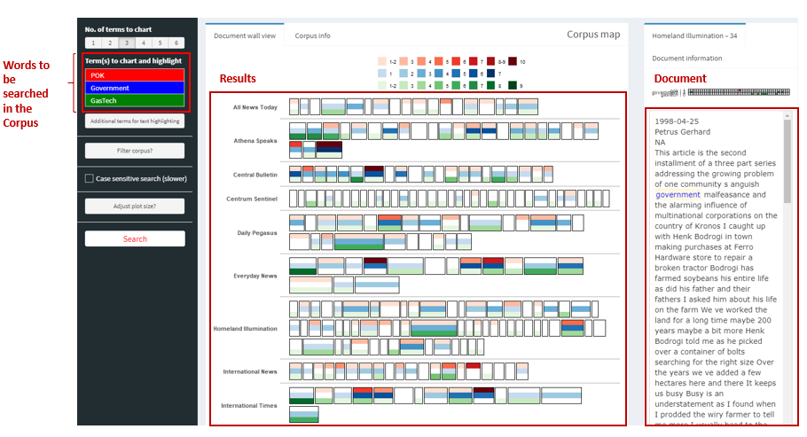
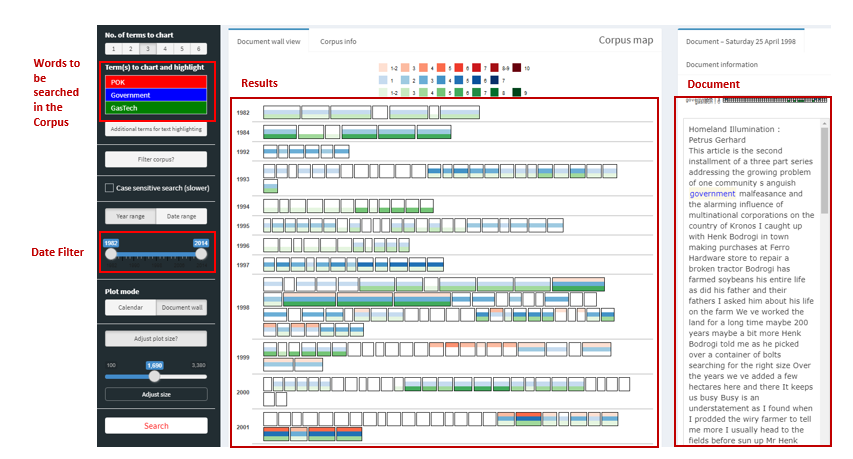

<style>

d-article div.sourceCode {
    background-color: rgba(247, 230, 230, 0.05);
    border-color: blue;
    border: 1px solid rgba(249, 83, 85, 0.2);
    border-radius: 1px;
    overflow-x: auto !important;
    max-width: 704px;

}

d-article pre{
    background-color: rgba(217, 217, 217, 0.05);
    #border: 1px solid rgba(217, 217, 217, 0.2);
    border-radius: 1px;
    overflow-x: auto !important;
    max-width: 704px;
}

::ng-deep div.vis-tooltip {
  position: absolute;
  visibility: visible;
  padding: 5px;
  white-space: nowrap;
  color: #000000;
  background-color: #f5f4ed;

  -moz-border-radius: 3px;
  -webkit-border-radius: 3px;
  border-radius: 3px;
  border: 1px solid #808074;

  box-shadow: 3px 3px 10px rgba(0, 0, 0, 0.2);
  pointer-events: none;

  z-index: 5;
}


</style>


```{css echo = FALSE}
body {line-height: 1;}
```


```{css zoom-lib-src, echo = FALSE}
script src = "https://ajax.googleapis.com/ajax/libs/jquery/3.4.1/jquery.min.js"
```


```{js zoom-jquery, echo = FALSE}
 $(document).ready(function() {
    $('body').prepend('<div class=\"zoomDiv\"></div>');
    // onClick function for all plots (img's)
    $('img:not(.zoomImg)').click(function() {
      $('.zoomImg').attr('src', $(this).attr('src')).css({width: '100%'});
      $('.zoomDiv').css({opacity: '1', width: 'auto', border: '1px solid white', borderRadius: '5px', position: 'fixed', top: '50%', left: '50%', marginRight: '-50%', transform: 'translate(-50%, -50%)', boxShadow: '0px 0px 50px #888888', zIndex: '50', overflow: 'auto', maxHeight: '100%'});
    });
    // onClick function for zoomImg
    $('img.zoomImg').click(function() {
      $('.zoomDiv').css({opacity: '0', width: '0%'}); 
    });
  });
```


```{r, message=FALSE, echo=F}
library(tidyverse)
library(lubridate)
library(DT)
```


```{r, echo=FALSE, message=FALSE, warning=F}
df.news <- read_csv('data/df_news.csv',locale = locale(encoding = "UTF-8")) %>% 
           select(-c(X1,caseno))
```


```{r, echo=FALSE}
df.news <- df.news %>%
            mutate(PUBLISHED = parse_date_time(PUBLISHED, orders = c("%y%m%d", "%d%m%y")))
```


```{r, echo=FALSE}
df.news <- df.news %>% 
            mutate(AUTHOR = str_remove(AUTHOR, "By "))
#df.news %>% distinct(AUTHOR)
```


```{r, echo=FALSE}
df.news <- df.news %>% 
            mutate(LOCATION = str_to_upper(LOCATION))
```


```{r, echo=FALSE}
df.news <- df.news %>% mutate(Text = str_replace_all(TEXT, "[[:punct:]]", " "))

```


```{r, message=FALSE, echo=FALSE}
df.emails <- read_csv('data/email headers.csv')
```


```{r, echo=FALSE}
df.emails <- df.emails %>% 
              mutate(To = str_remove_all(To,"@gastech.com.kronos|@gastech.com.tethys")) %>%
              mutate(From = str_remove_all(From,"@gastech.com.kronos|@gastech.com.tethys")) %>%
              mutate(To = str_replace_all(To,"[.]"," ")) %>%
              mutate(From = str_replace_all(From,"[.]"," ")) %>% 
              mutate(Date = parse_date_time(x = Date, orders =c("%m%d%y %H%M","%m%d%y")))  
```


```{r, echo=FALSE}
df.emails <- df.emails %>% 
              mutate(Date.Date =  date(Date)) %>% 
              mutate(Date.Time =  hms::as_hms(Date))
```


```{r, echo=FALSE}
df.emails <- df.emails %>% mutate(nTo = lengths(str_split(To,pattern=","))) %>% filter(nTo<=12)

```


```{r, message=FALSE, echo=FALSE}
df.emp <- readxl::read_xlsx('data/EmployeeRecords.xlsx')
```


```{r, echo=FALSE}
df.emp <- df.emp %>% 
  unite(FullName, FirstName, LastName, sep=" ", remove=FALSE)
```

## Loading the Libraries

The following libraries will be loade to build the visuals. 

```{r libraries, message=FALSE, warning=FALSE}
library(ggplot2)
library(plotly)
library(textnets)
library(ggwordcloud)
library(tidytext)
library(visNetwork)
library(textdata)
library(igraph)
library(ggraph)
library(tidygraph)
library(corporaexplorer) 
library(topicmodels)
library(widyr)
```


Corpora Explorer -  To Analyze the Texts by Source


The documents were built into two corpus, one was built according to the source and the other was by the date. 

The following two code can be run within R markdown to open the Shiny Application for document exploration by key word.

By source:

```{r corpora_explorer, eval=FALSE, message=FALSE, include=T}

all_news_by_source <- df.news %>% 
                    rename("Date"="PUBLISHED")

# This line of code adds in some details of the document in the document view. 

all_news_by_source$Text <- paste(all_news_by_source$Date, "\n", 
                                 all_news_by_source$AUTHOR, "\n",
                                 all_news_by_source$NOTE, "\n", 
                                 all_news_by_source$Text)

all_news_by_source <- all_news_by_source %>% 
                      select(-Date)

news_corpus_source <- prepare_data(
                        dataset = all_news_by_source,
                        date_based_corpus = F,
                        grouping_variable = "SOURCE")

explore(news_corpus_source)

```

Snapshot of Corpus by Source

```{r, out.width=700, echo=F}

```


By Date: 

```{r corpora_explorer_date, eval=FALSE, message=FALSE, include=T}

all_news_by_date <- df.news %>% 
                      rename("Date"="PUBLISHED") %>% 
                      mutate(Date = date(Date))

# This line of code adds in some details of the document in the document view. 
all_news_by_date$Text <- paste(all_news_by_date$SOURCE,
                               ": \n", 
                               all_news_by_date$AUTHOR, 
                               "\n", 
                               all_news_by_date$Text)

news_corpus_date <- prepare_data(
                      dataset = all_news_by_date,
                      date_based_corpus = T,
                      grouping_variable = "SOURCE")

explore(news_corpus_date)

```

Snapshot of Corpus by Date

```{r, echo=F, out.width=700}

```

## Building the Visuals for Question 1

For building the text network, the visTextNet function was used. 


The function does the following:

* calculates the term frequency inverse document frequency of each word; 
* creates a weighted adjacency matrix where the rows and columns are the groups and the cells describe the sum of 
overlapping TFIDF between them; 
* creates an igraph object from this adjacency matrix.

### Editing Functions

The functions retrieved from GitHub were re-edited for building the text visuals:

```{r VisTextChanged, message=F, warning=F}
VisTextNet_e <- function(text_network, alpha = .25, label_degree_cut=0, betweenness=FALSE){
  
  if (igraph::has.multiple(text_network))
    stop("textnets does not yet support multiple edges")
  if (is.null(V(text_network)$name)){
    text_network <- set_vertex_attr(text_network, "name", value = as.character(1:vcount(text_network)))
  }
  
  #create network backbone 
  
  e <- cbind(igraph::as_data_frame(text_network)[, 1:2 ], 
             weight =   E(text_network)$weight)
  
  # in
  w_in <- graph.strength(text_network, mode = "in")
  w_in <- data.frame(to = names(w_in), w_in, stringsAsFactors = FALSE)
  k_in <- degree(text_network, mode = "in")
  k_in <- data.frame(to = names(k_in), k_in, stringsAsFactors = FALSE)
  
  e_in <- e %>%
    left_join(w_in, by = "to") %>%
    left_join(k_in, by = "to") %>%
    mutate(alpha_in = (1-(weight/w_in))^(k_in-1))
  
  # out
  
  w_out <- graph.strength(text_network, mode = "out")
  w_out <- data.frame(from = names(w_out), w_out, stringsAsFactors = FALSE)
  k_out <- degree(text_network, mode = "out")
  k_out <- data.frame(from = names(k_out), k_out, stringsAsFactors = FALSE)
  
  e_out <- e %>%
    left_join(w_out, by = "from") %>%
    left_join(k_out, by = "from") %>%
    mutate(alpha_out = (1-(weight/w_out))^(k_out-1))
  
  e_full <- left_join(e_in, e_out, by = c("from", "to", "weight"))
  
  e_full <- e_full %>%
    mutate(alpha = ifelse(alpha_in < alpha_out, alpha_in, alpha_out)) %>%
    select(from, to, alpha)
  
  E(text_network)$alpha <- e_full$alpha
  
  pruned <- delete.edges(text_network, which(E(text_network)$alpha >= alpha))
  pruned <- delete.vertices(pruned, which(degree(pruned) == 0))
  
  
  # make degree for labelling most popular nodes
  V(pruned)$degree <- degree(pruned)
  
  # remove isolates
  isolates <- V(pruned)[degree(pruned)==0]
  pruned <- delete.vertices(pruned, isolates)
  
  # calculate modularity for coloring
  communities <- cluster_louvain(pruned) 
  
  #Cluster Lovain grouping was used for community detection as any text network is large in nature. 
  
  
  #calculate betweenness for sizing nodes
  size <- 25 #default 25
  
  if(betweenness){
    size <- betweenness(pruned) 
    
    size <- size/0.95
  }
  
  V(pruned)$community <- communities$membership
  
  V(pruned)$degree <- degree(pruned)
  
  ## Changed Code: 
  nodes <- data.frame(id = V(pruned)$name, 
                      title = paste0("Degree of Node: <br>",
                                     V(pruned)$degree),
                      group = V(pruned)$community,
                      size =  size
                      )
  
  nodes <- nodes[order(nodes$id, decreasing = F),]
  nodes$shadow <- TRUE
  nodes <- nodes %>% mutate(font.size = 20, font.weight= 900) 
  nodes$color.highlight.background <- "brown"

  edges <- get.data.frame(pruned, what="edges")[1:2]
  edges$value <- E(pruned)$weight
  nodes$color.highlight.background <- "brown" 

  visNetwork(nodes, edges) %>%
    visLayout(randomSeed = 123) %>% 
    visOptions(highlightNearest = TRUE, 
               nodesIdSelection = TRUE, 
               selectedBy = "group") %>% 
    visNodes(labelHighlightBold = T, size=20) %>%
    visIgraphLayout(layout = 'layout.davidson.harel') %>%
    visInteraction(multiselect = TRUE)
}
```

Similarly the Text Communities function was changed so as to return a dataframe of the communities and the names:

```{r TextCommChanged, message=F, warning=F}
TextComm_e <- function(text_network, alpha = .25, label_degree_cut=0, betweenness=FALSE){
  
  if (igraph::has.multiple(text_network))
    stop("textnets does not yet support multiple edges")
  if (is.null(V(text_network)$name)){
    text_network <- set_vertex_attr(text_network, "name", value = as.character(1:vcount(text_network)))
  }
  
  #create network backbone 
  
  e <- cbind(igraph::as_data_frame(text_network)[, 1:2 ], 
             weight =   E(text_network)$weight)
  
  # in
  w_in <- graph.strength(text_network, mode = "in")
  w_in <- data.frame(to = names(w_in), w_in, stringsAsFactors = FALSE)
  k_in <- degree(text_network, mode = "in")
  k_in <- data.frame(to = names(k_in), k_in, stringsAsFactors = FALSE)
  
  e_in <- e %>%
    left_join(w_in, by = "to") %>%
    left_join(k_in, by = "to") %>%
    mutate(alpha_in = (1-(weight/w_in))^(k_in-1))
  
  # out
  
  w_out <- graph.strength(text_network, mode = "out")
  w_out <- data.frame(from = names(w_out), w_out, stringsAsFactors = FALSE)
  k_out <- degree(text_network, mode = "out")
  k_out <- data.frame(from = names(k_out), k_out, stringsAsFactors = FALSE)
  
  e_out <- e %>%
    left_join(w_out, by = "from") %>%
    left_join(k_out, by = "from") %>%
    mutate(alpha_out = (1-(weight/w_out))^(k_out-1))
  
  e_full <- left_join(e_in, e_out, by = c("from", "to", "weight"))
  
  e_full <- e_full %>%
    mutate(alpha = ifelse(alpha_in < alpha_out, alpha_in, alpha_out)) %>%
    select(from, to, alpha)
  
  E(text_network)$alpha <- e_full$alpha
  
  pruned <- delete.edges(text_network, which(E(text_network)$alpha >= alpha))
  pruned <- delete.vertices(pruned, which(degree(pruned) == 0))
  
  
  # make degree for labelling most popular nodes
  V(pruned)$degree <- degree(pruned)
  
  # remove isolates
  isolates <- V(pruned)[degree(pruned)==0]
  pruned <- delete.vertices(pruned, isolates)
  
  communities <- cluster_louvain(pruned)

  V(pruned)$community <- communities$membership
  
  ## Changed Code:
  
  output <- data.frame(cbind(communities$names, 
                             communities$membership))
  names(output)<-c("SOURCE","Membership")
  
  return(output)

}
```


### Creating the VisNetwork for Texts

1. First, the common words are sieved out. This will included words such as GasTech, POK, that might skew the data.This data frame will be called `common_words`

```{r, message=F}

common_words <- df.news %>% 
                  unnest_tokens(word,Text) %>% 
                  anti_join(stop_words) %>% 
                  count(word) %>% 
                  filter(n>200) %>% 
                  mutate(lexicon = "CUSTOM")
```

2. Bind it to the `stop_words` dataframe

```{r, message=F}
stop_words2 <- stop_words %>% 
                bind_rows(common_words)

```

3. Next, we will create two dataframe. One from 1998 - 2014 (for analysis purpose), and the other in 2014(solely for exploratory purpose)

   This is done as new sources such as "Modern Rubicon", "Centrum Sentinel" and "Tethy News" will solely reporting in 2014 i.e. the kidnapping event. 
   
   In addition to that, some news sources such as "The International Times" were reporting as early as 1982. 
   
   To prevent skewing of the data, the period was split into such.
   
   Other notions for the lines of code are marked as comments in the code chunk below:
   
```{r, message=F}
clean_news_before <- df.news %>% 
                      filter(1998 <= year(PUBLISHED),
                             year(PUBLISHED)<2014) %>%
                      select(SOURCE, Text) %>% 
                      mutate(Text = gsub("\\d+", " ", Text)) %>% # Remove any digits
                      mutate(Text = str_to_lower(Text)) %>% # Make all lower case
                      unnest_tokens(word, Text) %>%
                      anti_join(stop_words2) %>% # antijoin will preserve all words that appear in df.news that do not appear in stop_word
                      group_by(SOURCE) %>% 
                      summarise(word = paste(word, collapse = ",")) # So that each new source is a single row and the column word contains all the words across the articules

clean_news_2014 <- df.news %>% 
                    filter(year(PUBLISHED)==2014) %>%
                    select(SOURCE, Text) %>% 
                    mutate(Text = gsub("\\d+", " ", Text)) %>%
                    mutate(Text = str_to_lower(Text)) %>%
                    unnest_tokens(word, Text) %>%
                    anti_join(stop_words2) %>%
                    group_by(SOURCE) %>% 
                    summarise(word = paste(word, collapse = ","))

```

4. Building the Text Network object for the period 1998-2014

```{r txt_ntwk_bf, messsage=F}

text_grouped <- clean_news_before %>% 
                group_by(SOURCE)

news_before <- PrepText(text_grouped, 
                         groupvar = "SOURCE", 
                         textvar = "word", 
                         node_type = "groups", 
                         tokenizer = "words", 
                         pos = "nouns", 
                         remove_stop_words = TRUE, 
                         compound_nouns = TRUE)

text_network_before <- CreateTextnet(news_before)
```

5. Visualising the Text Network

```{r vis_ntwk_bf,messsage=F}
set.seed(390)
VisTextNet_e(text_network_before)
```


6. Building the Text Network object for the period 2014

```{r txt_ntwk_2014,message=F, warning=F}
text_grouped2 <- clean_news_2014 %>% group_by(SOURCE)

new_2014 <- PrepText(text_grouped2, 
                         groupvar = "SOURCE", 
                         textvar = "word", 
                         node_type = "groups", 
                         tokenizer = "words", 
                         pos = "nouns", 
                         remove_stop_words = TRUE, 
                         compound_nouns = TRUE)

text_network_2014 <- CreateTextnet(new_2014)
```

7. Visualising the Text Network

```{r vis_ntwk_2014,message=F, warning=F}
set.seed(99)
VisTextNet_e(text_network_2014, label_degree_cut = 0) 
```

### Creating the Correlation Plot of Sources

The correlation plot will give an idea of the most similiar new sources based on the word and their counts. <br>
As we did before, they will be split into two time periods, while the latter is more for exploration purposes. 

1. Create the dataframe of the counts

```{r corrplot1, message=F, warning=F}
clean_news_before_count <- df.news %>% 
                            filter(1998 <= year(PUBLISHED),
                                   year(PUBLISHED)<2014) %>%
                            select(SOURCE, Text) %>% 
                            mutate(Text = gsub("\\d+", " ", Text)) %>%
                            mutate(Text = str_to_lower(Text)) %>%
                            unnest_tokens(word, Text) %>%
                            anti_join(stop_words2) %>%
                            group_by(SOURCE, word) %>% 
                            summarise(count = n()) %>%
                            ungroup()

knitr::kable(sample_n(clean_news_before_count,10), "simple") %>%
  kableExtra:: kable_paper("hover", 
                           full_width = F,
                           html_font = "helvetica")
```

2. Create the correlation dataframe

```{r, message=F, warning=F}
newsgroup_cors <- clean_news_before_count %>%
                  pairwise_cor(SOURCE, 
                               word, 
                               count, 
                               sort = TRUE)

knitr::kable(sample_n(newsgroup_cors,5), "simple") %>%
  kableExtra:: kable_paper("hover", 
                           full_width = F,
                           html_font = "helvetica")
```

3. Creating the ggplot object

```{r}
corr_plot_before <- ggplot(newsgroup_cors) +
                      geom_tile(aes(x=item1, y=item2, fill=correlation)) +
                      scale_fill_distiller(palette = "Spectral") +
                      labs(x = "",
                           y=" ", 
                           title = "Correlations of New Sources from 1998 to 2014",
                           fill = "Correlation") +
                      theme(axis.text.x = element_text(angle = 90, 
                                                       vjust = 0.5,
                                                       hjust=1), 
                            panel.background = element_rect(fill="white"),
                            panel.grid.major.y = element_blank(),
                            panel.grid.major.x = element_blank(),
                            axis.ticks = element_line(color = "grey"),
                            plot.title = element_text(size=15)
                            ) #+
                      #ggsave(filename = "images/1-corrplot.png",
                      #       width = 20, 
                      #       units = "cm")
#corr_plot_before
```

4. Repeat the same for 2014

```{r corrplot2, message=F, warning=F}
clean_news_2014_count <- df.news %>% 
                          filter(year(PUBLISHED) == 2014, month(PUBLISHED)==1) %>%
                          select(SOURCE, Text) %>% 
                          mutate(Text = gsub("\\d+", " ", Text)) %>%
                          mutate(Text = str_to_lower(Text)) %>%
                          unnest_tokens(word, Text) %>%
                          anti_join(stop_words2) %>%
                          group_by(SOURCE, word) %>% 
                          summarise(count = n())

newsgroup_cors_2014 <- clean_news_2014_count %>%
                        pairwise_cor(SOURCE, 
                                     word, 
                                     count, 
                                     sort = TRUE)

corr_plot_2014 <- ggplot(newsgroup_cors_2014) +
                  geom_tile(aes(x=item1, y=item2, fill=correlation)) +
                  theme(axis.text.x = element_text(angle = 90, 
                                                   vjust = 0.5,
                                                   hjust=1)) + 
                  scale_fill_distiller(palette = "Spectral") +
                  labs(x = "",
                       y=" ", 
                       title = "Correlations of New Sources in 2014",
                       fill = "Correlation") +
                  theme(panel.background = element_rect(fill="white"),
                        panel.grid.major.y = element_blank(),
                        panel.grid.major.x = element_blank(),
                        axis.ticks = element_line(color = "grey"),
                        plot.title = element_text(size=15)
                        ) #+
                  #ggsave(filename = "images/1-corrplot2.png",
                  #       width = 20, 
                  #       units = "cm")
#corr_plot_2014

```


```{r ngram_bf, warning=F, message=F, eval=F,echo=F}
wc_comms <- TextComm_e(text_network = text_network_before)

g_before_ngrams <- df.news %>% 
                      filter(1998 <= year(PUBLISHED),
                             year(PUBLISHED)<2014) %>%
                      select(SOURCE, Text) %>% 
                      mutate(Text = gsub("\\d+", " ", Text)) %>%
                      mutate(Text = str_to_lower(Text)) %>%
                      unnest_tokens(word, Text) %>%
                      anti_join(stop_words2) %>%
  
                      group_by(SOURCE) %>%
                      summarise(word = paste(word, collapse = ",")) %>% 
                      ungroup() %>%
  
                      unnest_tokens(word, word, token="ngrams", n=2) %>%
                      filter(word != 'NA') %>%
                      separate(word, c("word1", "word2"), sep = " ") %>%
  
                      group_by(SOURCE, word1, word2) %>%
                      summarise(n=n()) %>%
                      ungroup() %>%
  
                      group_by(SOURCE) %>%
                      top_n(n=8, wt=n) %>%
                      relocate(SOURCE, .after = last_col()) %>%
                      rename("from"="word1",
                             "to"="word2",
                             "value"="n",
                             "group"="SOURCE")
  
  
                      
add <- g_before_ngrams %>% 
    inner_join(wc_comms, by=c("group" = "SOURCE"))                
```


```{r vis_ngram_bf_group, eval=F, echo=F}

data_1 <- add %>% 
  filter(Membership ==1) %>% 
  graph_from_data_frame() %>%
  toVisNetworkData() 

visNetwork(data_1$nodes,data_1$edges)  %>% 
  visEdges(arrows = "middle") %>%
  visIgraphLayout() %>% 
  visNodes(font = list(size =30))


data_2 <- add %>% 
  filter(Membership ==2) %>% 
  graph_from_data_frame() %>%
  simplify() %>%
  toVisNetworkData() 

visNetwork(data_2$nodes,data_2$edges)  %>% 
  visEdges(arrows = "middle") %>%
  visIgraphLayout() %>% 
  visNodes(font = list(size =30))


data_3 <- add %>% 
  filter(Membership ==3) %>% 
  graph_from_data_frame() %>%
  toVisNetworkData() 

visNetwork(data_3$nodes,data_3$edges)  %>% 
  visEdges(arrows = "middle") %>%
  visIgraphLayout() %>% 
  visNodes(font = list(size =30))


data_4 <- add %>% 
  filter(Membership ==4) %>% 
  graph_from_data_frame() %>%
  toVisNetworkData() 

visNetwork(data_4$nodes,data_4$edges)  %>% 
  visEdges(arrows = "middle") %>%
  visIgraphLayout()%>% 
  visNodes(font = list(size =30))


data_5 <- add %>% 
  filter(Membership ==5) %>% 
  graph_from_data_frame() %>%
  toVisNetworkData()

visNetwork(data_5$nodes,data_5$edges) %>% 
  visEdges(arrows = "middle") %>%
  visIgraphLayout() %>% 
  visNodes(font = list(size =30))

```


```{r ngram_2014, warning=F, message=F, eval=F,echo=F}
wc_comms_2 <- TextComm_e(text_network = text_network_2014)

g_2014_ngrams <- df.news %>% 
                      filter(year(PUBLISHED)==2014) %>%
                      select(SOURCE, Text) %>% 
                      mutate(Text = gsub("\\d+", " ", Text)) %>%
                      mutate(Text = str_to_lower(Text)) %>%
                      unnest_tokens(word, Text) %>%
                      anti_join(stop_words2) %>%
  
                      group_by(SOURCE) %>%
                      summarise(word = paste(word, collapse = ",")) %>% 
                      ungroup() %>%
  
                      unnest_tokens(word, word, token="ngrams", n=2) %>%
                      filter(word != 'NA') %>%
                      separate(word, c("word1", "word2"), sep = " ") %>%
  
                      group_by(SOURCE, word1, word2) %>%
                      summarise(n=n()) %>%
                      ungroup() %>%
  
                      group_by(SOURCE) %>%
                      top_n(n=2, wt=n) %>%
                      relocate(SOURCE, .after = last_col()) %>%
                      rename("from"="word1",
                             "to"="word2",
                             "value"="n",
                             "group"="SOURCE")
  
  
                      
add2 <- g_2014_ngrams %>% 
    inner_join(wc_comms_2, by=c("group" = "SOURCE"))                
```


```{r vis_ngram_2014, eval=F, echo=F}

data<- add2 %>% 
  filter(Membership ==1) %>% 
  graph_from_data_frame() %>%
  toVisNetworkData() 

visNetwork(data$nodes,data$edges)  %>% visEdges(arrows = "middle")


data<- add2 %>% 
  filter(Membership ==2) %>% 
  graph_from_data_frame() %>%
  simplify() %>%
  toVisNetworkData() 

visNetwork(data$nodes,data$edges)  %>% visEdges(arrows = "middle")


data<- add2 %>% 
  filter(Membership ==3) %>% 
  graph_from_data_frame() %>%
  toVisNetworkData() 
#data$nodes$color <- "yellow"

visNetwork(data$nodes,data$edges)  %>% visEdges(arrows = "middle")


data<- add2 %>% 
  filter(Membership ==4) %>% 
  graph_from_data_frame() %>%
  toVisNetworkData() 

visNetwork(data$nodes,data$edges)  %>% visEdges(arrows = "middle")


data<- add2 %>% 
  filter(Membership ==5) %>% 
  graph_from_data_frame() %>%
  toVisNetworkData() 

visNetwork(data$nodes,data$edges) %>% visEdges(arrows = "middle")

```


### Understanding the Author's Links

1. Create the Author table

```{r author_links,message=F, warning=F}

author_links <- df.news %>% 
                group_by(SOURCE,AUTHOR) %>% 
                summarise(Count = n()) %>% 
                drop_na(AUTHOR) %>%
                rename("from" = "AUTHOR",
                       "to"="SOURCE",
                       "value"="Count")
knitr::kable(head(author_links,5)) %>%
  kableExtra:: kable_paper("hover", 
                           full_width = F,
                           html_font = "helvetica")
```

2. Create the visNetwork object

```{r, eval=F}
g_author <- graph_from_data_frame(author_links, directed=F)

data_author <- toVisNetworkData(g_author) 


data_author$nodes$color <- ifelse(data_author$nodes$id %in% 
                                    c("The Explainer", 
                                      "Athena Speaks", 
                                      "News Desk",
                                      "The Abila Post"),
                                      "#ffff00",
                                  ifelse(data_author$nodes$id %in% 
                                           c("Kronos Star"),
                                         "#7be141",
                                         ifelse(data_author$nodes$id %in% 
                                                  c("News Online Today",
                                                    "Homeland Illumination",
                                                    "All News Today"),
                                                "#97c2fc",
                                                "#e0e0e0")
                                          )
                                 )

visNetwork(data_author$nodes, 
           data_author$edges) %>% 
  visIgraphLayout() %>% 
  visNodes(font = list(size =18), 
           size = 20)

```


```{r location_links, eval=F, echo=F}

location_links <- df.news %>% 
                  group_by(SOURCE,LOCATION) %>% 
                  summarise(Count = n()) %>% 
                  rename("from" = "LOCATION",
                         "to"="SOURCE",
                         "value"="Count")

g_loc <- graph_from_data_frame(location_links, directed=F)

data_loc <- toVisNetworkData(g_loc) 


data_loc$nodes$color <- ifelse(data_loc$nodes$id %in% c("NA", 
                                                        "ABILA, KRONOS", 
                                                        "ELODIS, KRONOS",
                                                        "DAVOS,SWITZERLAND",
                                                        "CENTRUM, TETHYS"
                                                        ), 
                                  "#e88bc3", 
                                  "#b7e697")

data_loc$edges$color = "grey"
visNetwork(data_loc$nodes, data_loc$edges) %>% 
  visIgraphLayout("layout.davidson.harel") %>% 
  visNodes(font = list(size =18, weight=3)) %>%
  visOptions(nodesIdSelection = T, highlightNearest = list(enabled = T, degree = 0))


```

### TF-IDF of News sources

1. Set up the re-order func that is able to sort the facet's in descending order

[Link](https://github.com/dgrtwo/drlib/blob/master/R/reorder_within.R)
   
```{r reorder_func, message=F, warning=F}

reorder_within <- function(x, by, within, fun = mean, sep = "___", ...) {
  new_x <- paste(x, within, sep = sep)
  stats::reorder(new_x, by, FUN = fun)
}


scale_x_reordered <- function(..., sep = "___") {
  reg <- paste0(sep, ".+$")
  ggplot2::scale_x_discrete(labels = function(x) gsub(reg, "", x), ...)
}

scale_y_reordered <- function(..., sep = "___") {
  reg <- paste0(sep, ".+$")
  ggplot2::scale_y_discrete(labels = function(x) gsub(reg, "", x), ...)
}

```

2. Create the TF-IDF Dataframe using the `tidytext` package:

```{r tf-idf,message=F, warning=F}

tf_idf <- df.news %>% 
          filter(1998 <= year(PUBLISHED),
                 year(PUBLISHED)<2014) %>% 
          mutate(Text = gsub("\\d+", " ", Text)) %>%
          mutate(Text = str_to_lower(Text)) %>%
          unnest_tokens(word, Text) %>%
          anti_join(stop_words2) %>%
          group_by(SOURCE, word) %>%
          count() %>%
          ungroup() %>%
          bind_tf_idf(word, SOURCE, n) %>%
          group_by(SOURCE) %>%
          top_n(7,wt=tf_idf) 

knitr::kable(sample_n(tf_idf %>% ungroup(),5)) %>%
  kableExtra:: kable_paper("hover", 
                           full_width = F,
                           html_font = "helvetica")

```

2. Using the `TextComm_e` function earlier, we will create a dataframe of the communities

```{r,message=F, warning=F}
wc_comms <- TextComm_e(text_network = text_network_before)

knitr::kable(wc_comms %>% group_by(Membership) %>% sample_n(2)) %>%
  kableExtra:: kable_paper("hover", 
                           full_width = F,
                           html_font = "helvetica")
```

3. Join to the `tf_idf` dataframe

```{r,message=F, warning=F}
com_tf_idf <- inner_join(tf_idf, 
                         wc_comms, 
                         by=c("SOURCE")
                         )
knitr::kable(sample_n(com_tf_idf %>% ungroup(),5)) %>%
  kableExtra:: kable_paper("hover", 
                           full_width = F,
                           html_font = "helvetica")
```

4. Create the ggplot object

```{r,message=F, warning=F}
p <- com_tf_idf %>% 
      ggplot(aes(reorder_within(word, 
                            tf_idf, 
                            SOURCE),
                 tf_idf,
                 fill = Membership)) +
      geom_bar(stat = 'identity',color='black', size=0.1) +
      scale_x_reordered() +
      coord_flip() + 
      facet_wrap(~SOURCE, scales = "free_y", ncol = 7) + 
      scale_fill_manual(values=c("1"='#97c2fc',
                                  "2"="#7be141",
                                  "3"="#ffff00",
                                  "4"='#fb7e81',
                                  "5"='#eb7df4')) +
      labs(x='',y='', title = "TF-IDF") +
      theme(axis.title.x = element_blank(),
            axis.text.x = element_blank(),
            axis.ticks.x = element_blank(),
            panel.background = element_rect(fill="white"),
            strip.background =element_rect(fill="white"),
            plot.title = element_text(size=16, 
                                      margin=margin(0,0,5,0), 
                                      hjust=0.5)
            )

#p

```

### Average No. of Words Per Source

```{r words,message=F, warning=F, include=T}

df.news %>% 
    filter(1998 <= year(PUBLISHED), year(PUBLISHED)<2014) %>%
    unnest_tokens(word,Text) %>%
    filter(!(SOURCE %in% c("Tethys News", "Centrum Sentinel", "Modern Rubicon"))) %>%
    group_by(SOURCE) %>% 
    count(FILE, SOURCE) %>%
    summarise(avg_word = mean(n)) %>%
    ungroup() %>%
    left_join(wc_comms) %>%
    arrange(Membership, desc(avg_word)) %>%
    mutate(SOURCE2 = factor(SOURCE, levels=SOURCE)) %>%
    ggplot(aes(avg_word,SOURCE2,fill=Membership)) +
    geom_col(color='black', size=0.5) + 
    scale_fill_manual(values=c("1"='#97c2fc',
                                "2"="#7be141",
                                "3"="#ffff00",
                                "4"='#fb7e81',
                                "5"='#eb7df4')) +
    labs(x = "Average No. of Words",
         y = element_blank(),
         title = "Average No. of Words in each News Source") +
    theme(panel.background = element_rect(fill="white"),
          panel.grid.major.x = element_line("#d6d6d6"),
          axis.text = element_text(size = 10, color="black"),
          plot.title = element_text(size=15, margin=margin(0,0,30,0))
          ) #+
    #ggsave('images/5-1-2.png')

```


## Building the Visuals for Question 2

### Bi-Gram Plots by Source

1. Create the dataframe for the ngrams

```{r,message=F, warning=F}
g_before_ngrams <- df.news %>% 
                      filter(1998 <= year(PUBLISHED),
                             year(PUBLISHED)<2014) %>%
                      select(SOURCE, Text) %>% 
                      mutate(Text = gsub("\\d+", " ", Text)) %>%
                      mutate(Text = str_to_lower(Text)) %>%
                      unnest_tokens(word, Text) %>%
                      anti_join(stop_words) %>%
  
                      group_by(SOURCE) %>%
                      summarise(word = paste(word, collapse = ",")) %>% 
                      ungroup() %>%
  
                      unnest_tokens(word, word, token="ngrams", n=2) %>%
                      filter(word != 'NA') %>%
                      separate(word, c("word1", "word2"), sep = " ") %>%
  
                      group_by(SOURCE, word1, word2) %>%
                      summarise(n=n()) %>%
                      ungroup() %>%
  
  
                      group_by(SOURCE) %>%
                      top_n(n=50, wt=n) %>%
                      relocate(SOURCE, .after = last_col()) %>%
                      rename("from"="word1",
                             "to"="word2",
                             "value"="n",
                             "group"="SOURCE")

knitr::kable(sample_n(g_before_ngrams %>% ungroup,5)) %>%
  kableExtra:: kable_paper("hover", 
                           full_width = F,
                           html_font = "helvetica")
```


2. Feed into a for-loop to create the plots per source.

```{r all, message=F, warning=F, eval=F}

for (i in unique(g_before_ngrams$group)){
  
      e <- g_before_ngrams %>% 
            filter(group ==i)
      
      n <- e %>% 
            ungroup() %>%
            select(from, to, group) %>% 
            pivot_longer(cols=c("from","to")) %>% 
            left_join(get_sentiments("bing"), by=c("value"="word")) %>%
            replace_na(replace = list(sentiment = "none")) %>%
            mutate(color = ifelse(sentiment=="negative", "blue", 
                                ifelse(sentiment=="none", "grey",
                                       "red"))) %>%
            select(value, color) %>%
            rename("id" = "value") %>%
            group_by(id,color) %>%
            summarise(n=n())

      n$label <- n$id

      p<-visNetwork(n=n, 
                    edges = e, 
                    main = list(text = paste("News Source: ",i),
                                       style = "font-family:Verdana;font-weight:600;color:#000000;font-size:20px;text-align:center;")
                    )  %>% 
          visEdges(arrows = "middle") %>%
          visNodes(font = list(size =34, style="font-weight:600")) %>%
          visIgraphLayout(physics = F) %>%
          visOptions(highlightNearest = T, 
                     nodesIdSelection = T) %>%
          visInteraction(multiselect = TRUE)

      show(p)

}

```

3. Extension of the above for-loop to sieve out the primary sources and also identify paired word with key words such as "Gastech", "POK". 

   First a new dataset will be created `g_before_ngrams2` as the line of code, commented out below, is removed. 

```{r, message=F, warning=F}
g_before_ngrams2 <- df.news %>% 
                      filter(1998 <= year(PUBLISHED),
                             year(PUBLISHED)<2014) %>%
                      select(SOURCE, Text) %>% 
                      mutate(Text = gsub("\\d+", " ", Text)) %>%
                      mutate(Text = str_to_lower(Text)) %>%
                      unnest_tokens(word, Text) %>%
                      anti_join(stop_words) %>%
  
                      group_by(SOURCE) %>%
                      summarise(word = paste(word, collapse = ",")) %>% 
                      ungroup() %>%
  
                      unnest_tokens(word, word, token="ngrams", n=2) %>%
                      filter(word != 'NA') %>%
                      separate(word, c("word1", "word2"), sep = " ") %>%
  
                      group_by(SOURCE, word1, word2) %>%
                      summarise(n=n()) %>%
                      ungroup() %>%
  
  
                      group_by(SOURCE) %>%
                      #top_n(n=30, wt=n) %>% 
                      relocate(SOURCE, .after = last_col()) %>%
                      rename("from"="word1",
                             "to"="word2",
                             "value"="n",
                             "group"="SOURCE")
```

For Homeland Illumination, Kronos Star, and The Abila Post, we will use the filter marked as `--1`.
For The World, and International Times we will use the filter marked as `--2`. 

These filtered datasets will be saved as `g_before_ngrams_specific`

```{r specific, message=F, warning=F}

g_before_ngrams_specific <- g_before_ngrams2 %>% 
                            filter(group=="International Times") %>% # -- Change
                            #filter(from %in% c("pok",
                            #                   "elodis",
                            #                   "police",
                            #                   "government") | 
                            #       to %in% c("pok",
                            #                 "elodis",
                            #                 "police",
                            #                 "government")
                            #       ) # -- 1

  
                            filter(from %in% c("gastech",
                                               "international",
                                               "kronos",
                                               "sanjorge",
                                               "pok",
                                               "elodis",
                                               "protector")|
                                     to %in%
                                     c("gastech",
                                       "international",
                                       "kronos", 
                                       "sanjorge",
                                       "pok",
                                       "elodis",
                                       "protector")) # -- 2

      e <- g_before_ngrams_specific 

      n <- e %>% 
            ungroup() %>%
            select(from, to, group) %>% 
            pivot_longer(cols=c("from","to")) %>% 
            left_join(get_sentiments("bing"), by=c("value"="word")) %>%
            replace_na(replace = list(sentiment = "none")) %>%
            mutate(color.background = ifelse(sentiment=="negative", 
                                             "blue",
                                             ifelse(sentiment=="none", 
                                                    "grey",
                                                    "red")
                                             )
                   ) %>%
            select(value, color.background) %>%
            rename("id" = "value") %>%
            group_by(id,color.background) %>%
            summarise(n=n())

      n$label <- n$id
      n$color.highlight.background <- "brown"
      n$color.border <- "black"
      e$color <- "gray" 
      

      p<-visNetwork(n = n, 
                    edges = e, 
                    main = list(text = paste("News Source: ",unique(e$group)),
                                       style = "font-family:Verdana;font-weight:600;color:#000000;font-size:20px;text-align:center;")
                    )  %>% 
          visEdges(arrows = "middle", color = list(highlight = "brown")) %>%
          visNodes(font = list(size =34, style="font-weight:600")) %>%
          visIgraphLayout(physics = F, layout = "layout_nicely") %>%
          visOptions(highlightNearest = list(enabled = T, 
                                             algorithm = "all",
                                             degree = 0), 
                     nodesIdSelection = T
                    ) %>%
          visInteraction(multiselect = TRUE)

      
set.seed(390)
p

```

### Word Cloud by Communities 

1. Create a DTM Corpus i.e. Source and their word counts. This would be the same dataset as we created for the correlation plot. 

```{r,message=F, warning=F}

dtm_corpus <- df.news %>% 
              filter(1998 <= year(PUBLISHED),
                     year(PUBLISHED)<2014) %>%
              select(SOURCE, Text) %>% 
              mutate(Text = gsub("\\d+", " ", Text)) %>%
              mutate(Text = str_to_lower(Text)) %>%
              unnest_tokens(word, Text) %>%
              anti_join(stop_words2) %>%
              group_by(SOURCE, word) %>% 
              summarise(count = n()) %>% 
              inner_join(wc_comms) 

knitr::kable(sample_n(dtm_corpus %>% ungroup(),5)) %>%
  kableExtra:: kable_paper("hover", 
                           full_width = F,
                           html_font = "helvetica")

```

2. Feed into a for-loop to generate a WordCloud for each of the communities

```{r}
for (i in unique(dtm_corpus$Membership)){
  
  dtm_model <- dtm_corpus %>% 
               filter(Membership==i) %>%
               cast_dtm(SOURCE, word, count)

  lda_topics <- LDA(dtm_model,
                     k=2, 
                     method="Gibbs",
                     control = list(seed=333)) %>%
                  tidy(matrix = "beta")
  
  sources <- wc_comms %>% 
             filter(Membership==i) %>%
             select(SOURCE)
  
    
  word_probs <- lda_topics %>% 
                  group_by(topic) %>%
                  top_n(10, beta) %>%
                  ungroup() %>%
                  mutate(term2 = fct_reorder(term, beta)) 
  
  p <- ggwordcloud(word_probs$term, 
                   freq = word_probs$beta, 
                   colors = word_probs$topic) +
       labs(title = paste("Wordcloud for Cluster: ", i),
            subtitle = paste(unlist(sources), collapse = ', ')) +
       theme(plot.title = element_text(hjust = 0.5, size=14),
             plot.subtitle = element_text(hjust = 0.5, size=12))
  #show(p)
  #ggsave(paste('images/5-1-6-',i,".png",sep = ''))

}

```

## Building the Visuals for Question 3

### Email Network (Communities by Dept)

This network will show an overview of the employees and conversations within their departments. 

1. First we will set up the links, `links` , and nodes, `nodes_df`

Links: 

```{r}
links <- df.emails %>% 
          mutate(To = str_split(To,pattern=',')) %>% 
          unnest_longer(To) %>% 
          mutate(To = str_trim(To),
                 From = str_trim(From)) %>%
          filter(!(From==To)) %>%
          group_by(From, To) %>%
          summarise(count=n()) %>%
          rename(weight = count)

knitr::kable(head(links,5)) %>%
  kableExtra:: kable_paper("hover", 
                           full_width = F,
                           html_font = "helvetica")
```

Nodes:

```{r}
nodes_df <- data.frame(id = unique(c(links$From, links$To))) %>%
            left_join(df.emp, by = c("id"="FullName")) %>% 
            select(c(id, 
                     CurrentEmploymentTitle, 
                     CurrentEmploymentType)) %>%
            rename(title = CurrentEmploymentTitle, 
                   department = CurrentEmploymentType) %>%
            replace_na(list(department = "Executive", 
                            title = "CEO"))
knitr::kable(head(nodes_df,5)) %>%
  kableExtra:: kable_paper("hover", 
                           full_width = F,
                           html_font = "helvetica")

```

2. Next, the following code chunk will create the visNetwork

```{r, warning=F, message=F}

email_network <- graph_from_data_frame(d = links, 
                                       vertices = nodes_df
                                       )

email_network <- simplify(email_network)

nodes <- data.frame(id = V(email_network)$name, 
                    title = V(email_network)$name, 
                    group = V(email_network)$department)


edges <- get.data.frame(email_network, what="edges")[1:2]
edges$value <- links$weight
#edges$color.opacity <- 0.8
#edges$color.highlight <- "red"

nodes$color.highlight.background <- "brown"

nodes <- nodes %>% mutate(font.size = 25, 
                          font.weight= 1000)


lnodes <- data.frame(shape = rep('square',6),
                     label = c("Executive",
                               "Facilities",
                               "Engineering",
                               "Administration",
                               "Security",
                               "Information Technology"),
                     color.background = c("#FB7E81",
                                          "#7BE141",
                                          "#FFFF00",
                                          "#97C2FC",
                                          "#AD85E4",
                                          "#EB7DF4"),
                     color.border = rep('black',6),
                     font.align =  rep("center",6),
                     font.size = rep(20,6)
                     )


  p <- visNetwork(nodes = nodes, 
                  edges = edges) %>%
      visOptions(highlightNearest = list(enabled = T, degree = 1), 
                 nodesIdSelection = T,
                 selectedBy = "group"
                 
                 ) %>% 
      visEdges(width = 0.01,length = 10, scaling = list(min=0.1,max=3)) %>% 
      visLayout(randomSeed = 123) %>%
      visNodes(labelHighlightBold = T) %>%
      #visPhysics(stabilization = 5,
      #           barnesHut = list(springLength =230, avoidOverlap=0.2), 
      #           forceAtlas2Based = list(gravitaionalConstant = -100,
      #                                   centralGravity = 0.5)) %>%
      visIgraphLayout(layout = "layout_nicely") %>%
      visInteraction(multiselect = TRUE) %>%
      visLegend(enabled = T) %>%
      visGroups(groupname = "Executive", 
                # Red
                color = list(border = "#FA0A10", 
                             background = "#FB7E81", 
                             highlight = list(border = "#FA0A10", background = "#FB7E81"),
                             hover = list(background = "#FA0A10", border = "#FB7E81")
                             )) %>%
      visGroups(groupname = "Facilities", 
                # Green
                color = list(border = "#41A906", 
                             background = "#7BE141", 
                             highlight = list(border = "#41A906", background = "#7BE141"),
                             hover = list(background = "#41A906", border = "#7BE141")
                             )) %>%
      visGroups(groupname = "Engineering", 
                # Yellow
                    color = list(border = "#FFA500", 
                                 background = "#FFFF00", 
                                 highlight = list(border = "#FFA500", background = "#FFFF00"),
                                 hover = list(background = "#FFA500", border = "#FFFF00")
                                 )) %>%
      visGroups(groupname = "Administration", 
                # Blue
                    color = list(border = "#2B7CE9", 
                                 background = "#97C2FC", 
                                 highlight = list(border = "#2B7CE9", background = "#97C2FC"),
                                 hover = list(background = "#2B7CE9", border = "#97C2FC")
                                 )) %>%
      visGroups(groupname = "Security", 
                # Purple
                    color = list(border = "#7C29F0", 
                                 background = "#AD85E4", 
                                 highlight = list(border = "#7C29F0", background = "#AD85E4"),
                                 hover = list(background = "#7C29F0", border = "#AD85E4")
                                 )) %>%
      visGroups(groupname = "Information Technology", 
                # Magenta
                    color = list(border = "#E129F0", 
                                 background = "#EB7DF4", 
                                 highlight = list(border = "#E129F0", background = "#EB7DF4"),
                                 hover = list(background = "#E129F0", border = "#EB7DF4")
                                 )) %>%
      visLegend(zoom = T, addNodes = lnodes, useGroups = F)
    
      
```


```{r, echo=F, message=F, warning=F}
set.seed(333)
p
```


### Email Network (Communities by Weight)

The communities are created by weight i.e. the frequency of email correspondence. 

```{r, warning=F, message=F}

email_network_wt <- graph_from_data_frame(d = links, 
                                          vertices = nodes_df, 
                                          directed = T)

wt_comm <- edge.betweenness.community(email_network_wt, 
                                     weights = E(email_network_wt)$weight)

nodes_wt <- data.frame(id = V(email_network_wt)$name, 
                       title = V(email_network_wt)$title, 
                       group = factor(wt_comm$membership))

edges_wt <- get.data.frame(email_network_wt, what="edges")[1:2]

nodes_wt$color.highlight.background <- "brown"
nodes_wt <- nodes_wt %>% 
              mutate(font.size = 25,
                     font.weight= 1000)

visNetwork(nodes_wt, edges_wt) %>%
  visOptions(highlightNearest = TRUE, 
             nodesIdSelection = T,
             selectedBy = "group"
             ) %>% 
  visEdges(width = 0.2) %>% 
  visIgraphLayout(layout = 'layout_nicely') %>%
  visInteraction(multiselect = T) %>%
  visLegend(F)

```


### Email Network (Communities by Text)

1. First, we create the dataframe below `emails_grouped`. This dataframe contains email correspondence with cleaned and tokenized text. 

```{r,warning=F, message=F}

emails_grouped<- df.emails %>% 
                  mutate(To = str_split(To,pattern=',')) %>% 
                  unnest_longer(To) %>% 
                  mutate(To = str_trim(To),
                         From = str_trim(From)) %>%
                  filter(!(From==To)) %>%
                  unnest_tokens(word, Subject) %>%
                  anti_join(stop_words) %>% 
                  group_by(From,To) %>%
                  count(word) %>%
                  summarise(word = paste(word, collapse = ",")) %>%
                  ungroup() %>%
                  group_by(From) %>%
                  left_join(df.emp, by=c("From"="FullName")) %>%
                  select(c(From, To, word, CurrentEmploymentType)) %>%
                  rename(group = CurrentEmploymentType) %>%
                  replace_na(replace=list(From_dep = "Executive"))


knitr::kable(head(emails_grouped %>% ungroup(),5)) %>%
  kableExtra:: kable_paper("hover", 
                           full_width = F,
                           html_font = "helvetica") %>%
  kableExtra::column_spec(column = 3, width_max="7cm",extra_css = "overflow-x: scroll")


```


2. Create the Text Network

```{r,warning=F, message=F}

email_text <- PrepText(emails_grouped, 
                  groupvar = "From", 
                  textvar = "word", 
                  node_type = "groups", 
                  tokenizer = "words", 
                  compound_nouns = TRUE)

email_text_nt <- CreateTextnet(email_text)

```

3. Re-edit the `VisTextNet` function to include the coloring of nodes by department

```{r VisTextChanged_email, message=F, warning=F}
VisTextNet_e_2 <- function(text_network, alpha = .25, label_degree_cut=0, df){
  
  if (igraph::has.multiple(text_network))
    stop("textnets does not yet support multiple edges")
  if (is.null(V(text_network)$name)){
    text_network <- set_vertex_attr(text_network, "name", value = as.character(1:vcount(text_network)))
  }
  
  #create network backbone 
  
  e <- cbind(igraph::as_data_frame(text_network)[, 1:2 ], 
             weight =   E(text_network)$weight)
  
  # in
  w_in <- graph.strength(text_network, mode = "in")
  w_in <- data.frame(to = names(w_in), w_in, stringsAsFactors = FALSE)
  k_in <- degree(text_network, mode = "in")
  k_in <- data.frame(to = names(k_in), k_in, stringsAsFactors = FALSE)
  
  e_in <- e %>%
    left_join(w_in, by = "to") %>%
    left_join(k_in, by = "to") %>%
    mutate(alpha_in = (1-(weight/w_in))^(k_in-1))
  
  # out
  
  w_out <- graph.strength(text_network, mode = "out")
  w_out <- data.frame(from = names(w_out), w_out, stringsAsFactors = FALSE)
  k_out <- degree(text_network, mode = "out")
  k_out <- data.frame(from = names(k_out), k_out, stringsAsFactors = FALSE)
  
  e_out <- e %>%
    left_join(w_out, by = "from") %>%
    left_join(k_out, by = "from") %>%
    mutate(alpha_out = (1-(weight/w_out))^(k_out-1))
  
  e_full <- left_join(e_in, e_out, by = c("from", "to", "weight"))
  
  e_full <- e_full %>%
    mutate(alpha = ifelse(alpha_in < alpha_out, alpha_in, alpha_out)) %>%
    select(from, to, alpha)
  
  E(text_network)$alpha <- e_full$alpha
  
  pruned <- delete.edges(text_network, which(E(text_network)$alpha >= alpha))
  pruned <- delete.vertices(pruned, which(degree(pruned) == 0))
  
  size <- 25
  
  isolates <- V(pruned)[degree(pruned)==0]
  pruned <- delete.vertices(pruned, isolates)
 
  
  nodes <- data.frame(id = V(pruned)$name, 
                      title = paste0("Degree of Node: <br>",
                                     V(pruned)$degree),
                      size =  size
                      )
  
  nodes<-nodes %>% 
    left_join(select(df, FullName,CurrentEmploymentType), by= c("id"="FullName")) %>% 
    rename(group= CurrentEmploymentType) %>%
    replace_na(list(group="Executive"))
  
  nodes <- nodes[order(nodes$id, decreasing = F),]
  nodes$shadow <- TRUE
  nodes <- nodes %>% mutate(font.size = 20, font.weight= 900)
  nodes$color.highlight.background <- "brown"

  edges <- get.data.frame(pruned, what="edges")[1:2]
  edges$value <- E(pruned)$weight
  nodes$color.highlight.background <- "brown"
  
  lnodes <- data.frame(shape = rep('square',6),
                     label = c("Executive",
                               "Facilities",
                               "Engineering",
                               "Administration",
                               "Security",
                               "Information Technology"),
                     color.background = c("#FB7E81",
                                          "#7BE141",
                                          "#FFFF00",
                                          "#97C2FC",
                                          "#AD85E4",
                                          "#EB7DF4"),
                     color.border = rep('black',6),
                     font.align =  rep("center",6),
                     font.size = rep(20,6)
                     )

  visNetwork(nodes, edges) %>%
    visLayout(randomSeed = 123) %>% 
    visOptions(highlightNearest = TRUE, 
               nodesIdSelection = TRUE, 
               selectedBy = "group") %>% 
    visNodes(labelHighlightBold = T, size=20) %>%
    visEdges(width = 0.01,length = 10, scaling = list(min=0.1,max=3)) %>%
    visIgraphLayout(layout = 'layout.davidson.harel') %>%
    visInteraction(multiselect = TRUE) %>%
      visLegend(zoom = T, addNodes = lnodes, useGroups = F)  %>%
      visGroups(groupname = "Executive", 
                # Red
                color = list(border = "#FA0A10", 
                             background = "#FB7E81", 
                             highlight = list(border = "#FA0A10", background = "#FB7E81"),
                             hover = list(background = "#FA0A10", border = "#FB7E81")
                             )) %>%
      visGroups(groupname = "Facilities", 
                # Green
                color = list(border = "#41A906", 
                             background = "#7BE141", 
                             highlight = list(border = "#41A906", background = "#7BE141"),
                             hover = list(background = "#41A906", border = "#7BE141")
                             )) %>%
      visGroups(groupname = "Engineering", 
                # Yellow
                    color = list(border = "#FFA500", 
                                 background = "#FFFF00", 
                                 highlight = list(border = "#FFA500", background = "#FFFF00"),
                                 hover = list(background = "#FFA500", border = "#FFFF00")
                                 )) %>%
      visGroups(groupname = "Administration", 
                # Blue
                    color = list(border = "#2B7CE9", 
                                 background = "#97C2FC", 
                                 highlight = list(border = "#2B7CE9", background = "#97C2FC"),
                                 hover = list(background = "#2B7CE9", border = "#97C2FC")
                                 )) %>%
      visGroups(groupname = "Security", 
                # Purple
                    color = list(border = "#7C29F0", 
                                 background = "#AD85E4", 
                                 highlight = list(border = "#7C29F0", background = "#AD85E4"),
                                 hover = list(background = "#7C29F0", border = "#AD85E4")
                                 )) %>%
      visGroups(groupname = "Information Technology", 
                # Magenta
                    color = list(border = "#E129F0", 
                                 background = "#EB7DF4", 
                                 highlight = list(border = "#E129F0", background = "#EB7DF4"),
                                 hover = list(background = "#E129F0", border = "#EB7DF4")
                                 )) %>%
      visLegend(zoom = T, addNodes = lnodes, useGroups = F)
    
}
```

4. Create visNetwork object

```{r,warning=F, message=F}
set.seed(390)

VisTextNet_e_2(email_text_nt, df = df.emp)
```

### Creating the Email Conversation Plot

```{r,warning=F, message=F, echo=F,eval=F}

x <- df.emails %>% 
          mutate(To = str_split(To,pattern=',')) %>% 
          unnest_longer(To) %>% 
          mutate(To = str_trim(To),
                 From = str_trim(From)) %>%
          filter(!(From==To)) %>%
          unnest_tokens(word, Subject) %>%
          anti_join(stop_words) %>% 
          group_by(From,To, Date.Date) %>%
          count(word) %>% 
          arrange(desc(n)) %>%
          left_join(select(df.emp, FullName, CurrentEmploymentType, CurrentEmploymentTitle), by=c("From"="FullName")) %>%
          replace_na(list(CurrentEmploymentType = "Executive", CurrentEmploymentTitle="CEO"))
```

1. Create a new dataframe `x_full`.

This dataframe will contain the department each of the employee in the email is from.

```{r}
x_full <- df.emails %>% 
          mutate(To = str_split(To,pattern=',')) %>% 
          unnest_longer(To) %>% 
          mutate(To = str_trim(To),
                 From = str_trim(From)) %>%
          filter(!(From==To)) %>%
          mutate(Subject2 = str_replace_all(Subject, "[[:punct:]]", " ")) %>%
          left_join(select(df.emp, FullName, CurrentEmploymentType, CurrentEmploymentTitle), by=c("From"="FullName")) %>%
          replace_na(list(CurrentEmploymentType = "Executive", CurrentEmploymentTitle="CEO")) %>%
          rename(From_title = CurrentEmploymentTitle, From_dep =  CurrentEmploymentType) %>% 
          left_join(select(df.emp, FullName, CurrentEmploymentTitle, CurrentEmploymentType), by = c("To"="FullName")) %>%
          rename(To_title = CurrentEmploymentTitle, To_dep =  CurrentEmploymentType)

knitr::kable(head(x_full,5)) %>% 
  kableExtra:: kable_paper("hover", 
                           full_width = F,
                           html_font = "helvetica") %>%
  kableExtra::column_spec(column = 1:12, width_max="1cm",extra_css = "overflow-x: scroll")
```


```{r, echo=FALSE, eval=F}
x_full <- x_full %>% 
          mutate(s = str_replace(Subject, 
                                 "RE: ",
                                 "")
                 ) 
```

2. Feed into a for-loop to generate the conversation plot_ly object for each employee to identify suspicious/interesting emails

```{r first, warning=F, message=F}

for (i in sort(unique(c(x_full$From, x_full$To)))){
  
    dat <- x_full %>%
           filter(From==i)
    
    details<- x_full %>% 
              filter(From == i) %>% 
              select(From_dep, From_title)

    g <- ggplot(dat, aes(y=To, x=Date.Time))+ 
        geom_point(#position=position_dodge(width=1),
                   size=2, alpha = 0.6, stroke=0.5, shape=21,
                   aes(text = sprintf("Sub: %s<br>Date: %s<br>To: %s<br>To_Title: %s<br>To_Dep: %s<br>Time Sent: %s<br>", 
                                      Subject2, 
                                      Date.Date, 
                                      To,
                                      To_title, 
                                      To_dep,
                                      Date.Time),
                      )
                   ) +
        geom_line(aes(group = Subject2, color= Subject2), size=0.2) +
        labs(y="",x="Time",title = paste(i,paste(unique(details), collapse = ',')), 
             group="", 
             color="") +
        theme(legend.text = element_text(size = 8),
              panel.background = element_rect(fill="white"),
              panel.grid.major.y = element_line(color="#f0f0f0"),
              plot.title = element_text(size=14)
              )

    gg <- ggplotly(g, tooltip = c("text")) 

    #show(gg)
     
}
```


Example:

```{r}
gg
```

3. Create the datatable object

```{r, warning=F, message=F}
m <- x_full %>%
  mutate(s = str_replace(Subject,"RE: ","")) 

temp_g <- m %>% 
            filter(str_detect(s, "Guy|guy"))

temp_g %>% 
  select(From, From_title, To, To_title, Date.Date, Date.Time, Subject) %>% 
  DT::datatable(fillContainer = F, options = list(pageLength = 4), rownames = F)

```

4. Create the VisNetwork Object

```{r}
temp_g_links <- temp_g %>% 
                  select(From, To, Subject) %>% 
                  rename(group = Subject)

temp_g_nodes <- data.frame(id = unique(c(temp_g$From, temp_g$To)))
#temp_g_nodes$title <- temp_g_nodes$id

temp_g_nodes <- temp_g_nodes %>% 
                  left_join(select(df.emp, FullName, CurrentEmploymentType), by = c('id' = 'FullName')) %>%
                  rename(group = CurrentEmploymentType) %>%
                  replace_na(list(group = "Executive"))

temp_g_nodes$color.highlight.background <- "brown"


temp_graph <- graph_from_data_frame(d = temp_g_links,
                                    vertices = temp_g_nodes,
                                    directed = T)

lnodes <- data.frame(shape = rep('square',6),
                     label = c("Executive",
                               "Facilities",
                               "Engineering",
                               "Administration",
                               "Security",
                               "Information Technology"),
                     color.background = c("#FB7E81",
                                          "#7BE141",
                                          "#FFFF00",
                                          "#97C2FC",
                                          "#AD85E4",
                                          "#EB7DF4"),
                     color.border = rep('black',6),
                     font.align =  rep("center",6),
                     font.size = rep(20,6)
                     )

data <- toVisNetworkData(temp_graph)

visNetwork(data$nodes, data$edges) %>%
  visEdges(arrows = "middle",width = 0.01,length = 5, scaling = list(min=0.1,max=3)) %>%
  visIgraphLayout() %>%
  visNodes(size=20) %>%
  visOptions(nodesIdSelection = T, highlightNearest = T) %>%
  visLegend(zoom = T, addNodes = lnodes, useGroups = F)  %>%
      visGroups(groupname = "Executive", 
                # Red
                color = list(border = "#FA0A10", 
                             background = "#FB7E81", 
                             highlight = list(border = "#FA0A10", background = "#FB7E81"),
                             hover = list(background = "#FA0A10", border = "#FB7E81")
                             )) %>%
      visGroups(groupname = "Facilities", 
                # Green
                color = list(border = "#41A906", 
                             background = "#7BE141", 
                             highlight = list(border = "#41A906", background = "#7BE141"),
                             hover = list(background = "#41A906", border = "#7BE141")
                             )) %>%
      visGroups(groupname = "Engineering", 
                # Yellow
                    color = list(border = "#FFA500", 
                                 background = "#FFFF00", 
                                 highlight = list(border = "#FFA500", background = "#FFFF00"),
                                 hover = list(background = "#FFA500", border = "#FFFF00")
                                 )) %>%
      visGroups(groupname = "Administration", 
                # Blue
                    color = list(border = "#2B7CE9", 
                                 background = "#97C2FC", 
                                 highlight = list(border = "#2B7CE9", background = "#97C2FC"),
                                 hover = list(background = "#2B7CE9", border = "#97C2FC")
                                 )) %>%
      visGroups(groupname = "Security", 
                # Purple
                    color = list(border = "#7C29F0", 
                                 background = "#AD85E4", 
                                 highlight = list(border = "#7C29F0", background = "#AD85E4"),
                                 hover = list(background = "#7C29F0", border = "#AD85E4")
                                 )) %>%
      visGroups(groupname = "Information Technology", 
                # Magenta
                    color = list(border = "#E129F0", 
                                 background = "#EB7DF4", 
                                 highlight = list(border = "#E129F0", background = "#EB7DF4"),
                                 hover = list(background = "#E129F0", border = "#EB7DF4")
                                 )) %>%
      visLegend(zoom = T, addNodes = lnodes, useGroups = F) %>%
    visInteraction(multiselect = TRUE)

```


### Creating the Age Comparison Plot

1. Create the column of the approximate age, which is 2014 - birth year

```{r,warning=F, message=F}
df.emp <-df.emp %>% 
          mutate(Approx_age = 2014 - year(BirthDate))

```

2. Create an dataframe as follow,`age_df`

```{r, warning=F, message=F}

age_df <- df.emp %>% 
          select(FullName, Approx_age, CurrentEmploymentType) %>% 
          mutate(FullName2 = fct_reorder(FullName,CurrentEmploymentType)) %>%
          mutate(hjust = ifelse(Approx_age >60, 1.1, -0.1)) %>%
          mutate(vjust =  ifelse(FullName2 == "Varja Lagos",0.5,0.1))
```

3. Create the ggplot object

```{r, eval=F, include=T}
age_df %>% 
    ggplot(aes(x = Approx_age, y= FullName2)) +
    geom_point(aes(fill = CurrentEmploymentType), size=3, shape=21, stroke=0.5, color='black')  +
    scale_fill_manual(values=c("#97C2FC","#FFFF00", "#FB7E81", "#7BE141","#EB7DF4","#7C29F0"))+
    geom_text(aes(label=FullName2, hjust = hjust, vjust=vjust), size=3)+
    scale_x_continuous(breaks = c(20, 25,30,35,40,45,50,55,60))+
    labs(y="",x="Time",title = "Approximate Ages of GasTech Employees in 2014", color="Department") +
    theme(legend.text = element_text(size = 8),
          panel.background = element_rect(fill="white"),
          panel.grid.major.x = element_line(color="#c9c9c9", linetype = 3),
          panel.border = element_rect(color="grey", fill=NA),
          plot.title = element_text(size=14),
          axis.text.y = element_blank(),
          axis.ticks.x  = element_blank(),
          axis.ticks.y  = element_blank(),
          
          )#+
   #ggsave(filename = 'images/5-Age.png', width = 30, units = "cm")

```


```{r age_vis,warning=F, message=F, echo=F, eval=F}
age_link <- df.emp %>%
              select(FullName, Approx_age) %>%
              rename(From = FullName,
                     To =  Approx_age) #%>%
              #mutate(To = as.character(To))

age_nodes <- data.frame(id = unique(c(age_link$From, age_link$To)))
age_nodes <- age_nodes %>% 
                left_join(select(df.emp, FullName, CurrentEmploymentType), by = c("id"="FullName")) %>%
                rename(group =  CurrentEmploymentType) %>%
                replace_na(list(group="None"))

age_nodes$title <- age_nodes$id
#age_nodes$color <- ifelse(str_length(age_nodes$id)<=2,"blue","black")
age_nodes$font.size <- 25
age_nodes$font.weight <- 1000


age_g <- graph_from_data_frame(d = age_link, 
                      vertices = age_nodes, 
                      directed = T)
data_age <- toVisNetworkData(age_g)

visNetwork(nodes = data_age$nodes, 
           edges = data_age$edges) %>%
  visNodes(size=15) %>%
  visOptions(nodesIdSelection = T, highlightNearest = T) %>%
  visIgraphLayout(layout = "layout_nicely") %>%
  visLegend() %>%
  visGroups(groupname = "Executive", 
                # Red
                color = list(border = "#FA0A10", 
                             background = "#FB7E81", 
                             highlight = list(border = "#FA0A10", background = "#FB7E81"),
                             hover = list(background = "#FA0A10", border = "#FB7E81")
                             )) %>%
      visGroups(groupname = "Facilities", 
                # Green
                color = list(border = "#41A906", 
                             background = "#7BE141", 
                             highlight = list(border = "#41A906", background = "#7BE141"),
                             hover = list(background = "#41A906", border = "#7BE141")
                             )) %>%
      visGroups(groupname = "Engineering", 
                # Yellow
                    color = list(border = "#FFA500", 
                                 background = "#FFFF00", 
                                 highlight = list(border = "#FFA500", background = "#FFFF00"),
                                 hover = list(background = "#FFA500", border = "#FFFF00")
                                 )) %>%
      visGroups(groupname = "Administration", 
                # Blue
                    color = list(border = "#2B7CE9", 
                                 background = "#97C2FC", 
                                 highlight = list(border = "#2B7CE9", background = "#97C2FC"),
                                 hover = list(background = "#2B7CE9", border = "#97C2FC")
                                 )) %>%
      visGroups(groupname = "Security", 
                # Purple
                    color = list(border = "#7C29F0", 
                                 background = "#AD85E4", 
                                 highlight = list(border = "#7C29F0", background = "#AD85E4"),
                                 hover = list(background = "#7C29F0", border = "#AD85E4")
                                 )) %>%
      visGroups(groupname = "Information Technology", 
                # Magenta
                    color = list(border = "#E129F0", 
                                 background = "#EB7DF4", 
                                 highlight = list(border = "#E129F0", background = "#EB7DF4"),
                                 hover = list(background = "#E129F0", border = "#EB7DF4")
                                 )) %>%
      visGroups(groupname = "None", 
                # Magenta
                    color = list(border = "#C37F00", 
                                 background = "#FFA807", 
                                 highlight = list(border = "#C37F00", background = "#FFA807"),
                                 hover = list(background = "#C37F00", border = "#FFA807 ")
                                 ))
  
  

```

### Creating the Citizenship Chart

```{r city_vis,warning=F, message=F}
citi_link <- df.emp %>%
              select(FullName, CitizenshipCountry, CurrentEmploymentType ) %>%
              rename(From = FullName,
                     To =  CitizenshipCountry,
                     group = CurrentEmploymentType) 
              

citi_nodes <- data.frame(id = unique(c(citi_link$From, citi_link$To)))
citi_nodes <- citi_nodes %>% 
                left_join(select(df.emp, FullName, CurrentEmploymentType), by = c("id"="FullName")) %>%
                rename(group =  CurrentEmploymentType) %>%
                replace_na(list(group="Place"))

citi_nodes$title <- citi_nodes$id
#citi_nodes$color <- ifelse(str_length(citi_nodes$id)==6,"blue","black")
citi_nodes$font.size <- 25
citi_nodes$font.weight <- 1000


citi_g <- graph_from_data_frame(d = citi_link, 
                      vertices = citi_nodes, 
                      directed = T)
data_citi <- toVisNetworkData(citi_g)

lnodes <- data.frame(shape = rep('square',6),
                     label = c("Executive",
                               "Facilities",
                               "Engineering",
                               "Administration",
                               "Security",
                               "Information Technology"),
                     color.background = c("#FB7E81",
                                          "#7BE141",
                                          "#FFFF00",
                                          "#97C2FC",
                                          "#AD85E4",
                                          "#EB7DF4"),
                     color.border = rep('black',6),
                     font.align =  rep("center",6),
                     font.size = rep(20,6)
                     )

visNetwork(nodes = data_citi$nodes, 
           edges = data_citi$edges) %>%
  visNodes(size=15) %>%
  visOptions(highlightNearest = TRUE, 
             nodesIdSelection = T,
             selectedBy = "group"
             ) %>% 
  visIgraphLayout(layout = "layout_as_star") %>%
  visLegend(zoom = T, addNodes = lnodes, useGroups = F) 


```

### Creating the Military Service Chart

1. Create new columns `MilitaryStartYear` and `MilitaryDischargeYear` and add it to the `df.emp` dataframe

```{r,warning=F, message=F}
df.emp <- df.emp %>% 
          mutate(army_year = year(MilitaryDischargeDate)) %>%
          mutate(disch = paste(MilitaryServiceBranch, army_year)) %>%
          mutate(MilitaryStartYear = year(MilitaryDischargeDate)-2) %>%
          mutate(MilitaryDischargeYear = year(MilitaryDischargeDate))
          
```

2. Two charts will be created, one for Kronos and the other for Tethys. 

```{r army_gg,warning=F, message=F, include=T, eval=F}
mil_data<-df.emp %>%
          filter(!is.na(MilitaryDischargeYear)) %>%
          mutate(ArmyLoc =  ifelse(str_detect(MilitaryServiceBranch,"Kronos"),"Kronos","Tethys")) %>%
          filter(ArmyLoc == "Kronos")

mil_data %>%
  ggplot(aes(y = FullName, x = MilitaryStartYear)) + 
  geom_point(size=2, color="#81b879") +
  geom_point(aes(MilitaryDischargeYear), color="#769ab5", size=2) +
  geom_segment(aes(x=MilitaryStartYear, xend=MilitaryDischargeYear, y=FullName,yend=FullName), size=0.5, alpha=0.7) +
  scale_x_continuous(breaks = seq(min(mil_data$MilitaryStartYear), max(mil_data$MilitaryDischargeYear), by=2))+
  #scale_color_manual(values = c("#97C2FC","#7BE141","#AD85E4"))+
  #facet_wrap(~ArmyLoc, scales = "free") +
  labs(x = "Year",y ="", title="Time Served in the Military in Kronos")+
  theme(panel.background = element_rect(fill ="white"),
        panel.grid.major.y = element_line(colour = "grey",linetype = 3),
        panel.grid.major.x = element_line(colour = "grey",linetype = 3),
        panel.border = element_rect(color="grey", fill=NA),
        axis.ticks.x  = element_blank(),
        axis.ticks.y  = element_blank()) + 
  ggsave('images/5-3-2.png',width = 30, units = "cm")

```


```{r army_gg2,warning=F, message=F, include=T, eval=F}
mil_data<-df.emp %>%
          filter(!is.na(MilitaryDischargeYear)) %>%
          mutate(ArmyLoc =  ifelse(str_detect(MilitaryServiceBranch,"Kronos"),"Kronos","Tethys")) %>%
          filter(ArmyLoc == "Tethys")

mil_data %>%
  ggplot(aes(y = FullName, x = MilitaryStartYear)) + 
  geom_point(size=2, color="#81b879") +
  geom_point(aes(MilitaryDischargeYear), color="#769ab5", size=2) +
  geom_segment(aes(x=MilitaryStartYear, xend=MilitaryDischargeYear, y=FullName,yend=FullName), size=0.5, alpha=0.7) +
  #scale_x_continuous(breaks = seq(min(mil_data$MilitaryStartYear), max(mil_data$MilitaryDischargeYear), by=2))+
  scale_x_continuous(breaks = seq(1982, 2012,by=2), limits = c(1982, 2012))+
  #scale_color_manual(values = c("#97C2FC","#7BE141","#AD85E4"))+
  #facet_wrap(~ArmyLoc, scales = "free") +
  labs(x = "Year",y ="", title="Time Served in the Military in Tethys")+
  theme(panel.background = element_rect(fill ="white"),
        panel.grid.major.y = element_line(colour = "grey",linetype = 3),
        panel.grid.major.x = element_line(colour = "grey",linetype = 3),
        panel.border = element_rect(color="grey", fill=NA),
        axis.ticks.x  = element_blank(),
        axis.ticks.y  = element_blank()) + 
  ggsave('images/5-3-3.png',width = 30, units = "cm", height = 10)


```

### Creating the Year Joined Chart

```{r join_gg, warning=F,message=F, eval=F}
year_labels <- unique(substr(sort(year(df.emp$CurrentEmploymentStartDate)),3,4))
year_labels[1] <- "1990"
year_labels[20] <- "2013"

df.emp %>% 
    select(FullName, CurrentEmploymentStartDate, CurrentEmploymentType) %>% 
    mutate(FullName2 = fct_reorder(FullName,CurrentEmploymentType)) %>%
    mutate(Year  = year(CurrentEmploymentStartDate )) %>% 
    mutate(hjust = ifelse(FullName2 =="Sten Sanjorge Jr.", -0.1, 1.1)) %>%
    ggplot(aes(x = Year, y= FullName2)) +
    geom_point(aes(fill = CurrentEmploymentType), size=3, shape=21, color='black', stroke=0.5) +
    geom_text(aes(label=FullName2, hjust =  hjust), size=3) +
    scale_x_continuous(breaks = sort(unique(year(df.emp$CurrentEmploymentStartDate))), labels = year_labels) +
    scale_fill_manual(values=c("#97C2FC","#FFFF00", "#FB7E81", "#7BE141","#EB7DF4","#7C29F0"))+
    labs(y="",x="Year",title = "Year Employee of GasTech Joined", color="Department") +
    theme(legend.text = element_text(size = 5),
          panel.background = element_rect(fill="white"),
          panel.grid.major.x = element_line(color="#c9c9c9", linetype = 3),
          panel.border = element_rect(color="grey", fill=NA),
          plot.title = element_text(size=14),
          axis.text.y = element_blank(),
          axis.ticks.x  = element_blank(),
          axis.ticks.y  = element_blank()
          ) #+ 
   # ggsave('images/5-3-7.png',width = 30, units = "cm")

```


