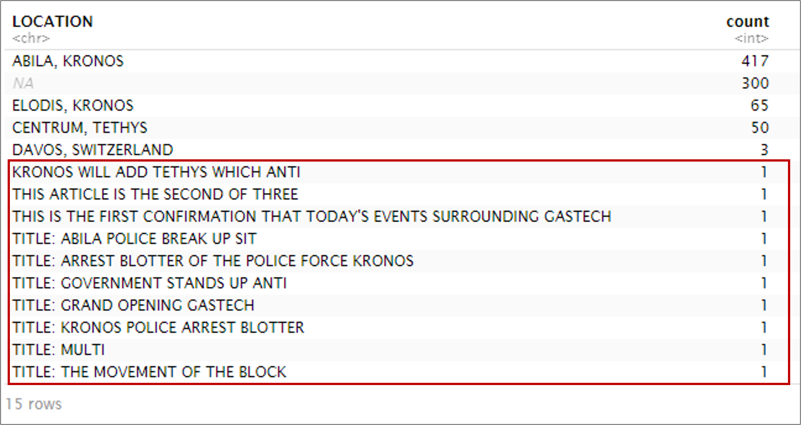
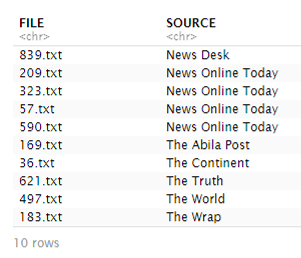

<style>

d-article div.sourceCode {
    background-color: rgba(247, 230, 230, 0.05);
    border-color: blue;
    border: 1px solid rgba(249, 83, 85, 0.2);
    border-radius: 1px;
    overflow-x: auto !important;
    max-width: 704px;

}

d-article pre{
    background-color: rgba(217, 217, 217, 0.05);
    #border: 1px solid rgba(217, 217, 217, 0.2);
    border-radius: 1px;
    overflow-x: auto !important;
    max-width: 704px;
}
.tooltip {
  position: relative;
  display: inline-block;
  border-bottom: 1px dotted black;
  background-color: white;
  border-color: coral;
}

.tooltip .tooltiptext {
  visibility: visible;
  width: auto;
  background-color: white;
  color: #000000;
  text-align: center;
  border-radius: 6px;
  padding: 5px 0;
  position: absolute;
  z-index: 1;
  bottom: 150%;
  left: 50%;
  margin-left: -60px;
}

</style>


```{css echo = FALSE}
body {line-height: 1;}
```

```{css zoom-lib-src, echo = FALSE}
script src = "https://ajax.googleapis.com/ajax/libs/jquery/3.4.1/jquery.min.js"
```


```{js zoom-jquery, echo = FALSE}
 $(document).ready(function() {
    $('body').prepend('<div class=\"zoomDiv\"></div>');
    // onClick function for all plots (img's)
    $('img:not(.zoomImg)').click(function() {
      $('.zoomImg').attr('src', $(this).attr('src')).css({width: '100%'});
      $('.zoomDiv').css({opacity: '1', width: 'auto', border: '1px solid white', borderRadius: '5px', position: 'fixed', top: '50%', left: '50%', marginRight: '-50%', transform: 'translate(-50%, -50%)', boxShadow: '0px 0px 50px #888888', zIndex: '50', overflow: 'auto', maxHeight: '100%'});
    });
    // onClick function for zoomImg
    $('img.zoomImg').click(function() {
      $('.zoomDiv').css({opacity: '0', width: '0%'}); 
    });
  });
```


```{r, echo=FALSE}
knitr::opts_chunk$set(tidy.opts=list(blank=FALSE, width.cutoff = 30))
```

## 3 Data Preparation

The MC1 has the following data/documents:

* Historical Documents 
* News Articles 
* Resumes (Word documents) 
* Email Headers (CSV File) 
* Employee Records (XLSX File) 
* Factbook - Kronos (Word document) 
* Factbook - Tethys (Word document) 
* GAStech Kronos Organization Chart (PDF Image) 
* Map of Krono (Image)

### 3.1 News Article Data

First, we will load the following libraries for the data clean:

```{r, message=FALSE}
library(tidyverse)
library(lubridate)
library(DT)
```

#### 3.1.1 Merging the New Articles
The MC1 folder contains a folder `News Articles`. Within it are subfolders containing the 29 different news sources, within which are articles in a text format. 

We will merge all of the new article's contents into a tidy format for text processing later, this means that each row will represent one observation and each column, one variable. 

The text file have been tagged as such:

```{r, echo=FALSE, out.width=250}

```

Running the following code chunk will give us the combined data:

<a id="first_chunk"></a>
```{r, eval=FALSE}
curr_dir = c(dir(path = 'MC1/News Articles/'))
df.news = data.frame()
counter = 1

for (folder in curr_dir){
  
  files_in_curr_dir <- c(list.files(path = paste('MC1/News Articles/', folder,
                                                 '/', sep='')))
  #print(files_in_curr_dir)

  for (file in files_in_curr_dir){
      vector <- c()
      chunk_text <- c()
      
      for (i in as.vector(readLines(paste('MC1/News Articles/', folder,
                                          '/', file, sep = '')))){
        if (grepl("SOURCE:|LOCATION:|AUTHOR:|PUBLISHED:|TITLE:|NOTE:", i, 
                  fixed = FALSE)){
          vector <- c(vector,(i))
        } else if(grepl("\\S+",i)){
          chunk_text<- c(chunk_text,i)
        }
      }
      
      chunk_text <- capture.output(cat(chunk_text))
      chunk_text <- paste("TEXT:", chunk_text)
      fileName <- c(paste("FILE:",file))
      article <- c(fileName,vector,chunk_text)

      
      textlist <- lapply(1:length(article),
                         function(j) data.frame(
                           caseno=counter,
                           rawdata=article[[j]],
                           stringsAsFactors = FALSE))
      
      df <- do.call(rbind, textlist)
      df[,c("type","entry")] <- str_trim(str_split_fixed(df$rawdata,":",2))
      df <- df[,c("caseno","type","entry")]
      df <- pivot_wider(df,
                        names_from = type,
                        values_from = entry)
      
      df.news <- dplyr::bind_rows(df.news,df)
      #print(paste(folder,file))
      
      counter <- counter + 1
  }
}

```

When running the above code chunk, the for-loop will be interrupted multiple times due to the following error:

```{r, echo=FALSE, out.width=250}

```

During the run of the code, we can check which file gives us the error by looking at the `Global Environment` section of the RStudio window as shown below:

```{r, echo=FALSE, out.width=250}

```
This tells us that the interrupting file is `37.txt` in the `Central Bulletin` folder.


This error is a result of errored placement of the tags within the file. Opening up the file shown above we can see that there are multiple tags. As such, there is an attempt to concatenate a list and character, which is not possible.

```{r, echo=FALSE, out.width=250}

```

Upon running the entire code, the files that have the errors have been identified as:

* 37.txt – Central Bulletin
* 791.txt – Daily Pegasus
* 188.txt – News Online Today
* 52.txt – News Online Today
* 570.txt – News Online Today
* 36.txt – The Continent
* 127.txt – The Explainer
* 205.txt – The Explainer

Out of 845 files, there are 8 such files with error. Since there is a small number, we will edit ourselves. 

```{r, echo=FALSE}

```

Once the files have been edited, re-run the [first code chunk](#first_chunk) to get the final merged dataframe, `df.news`.

```{r, echo=FALSE, out.width=250}

```

```{r, echo=FALSE, message=FALSE, warning=F}
df.news <- read_csv('data/df_news.csv',locale = locale(encoding = "UTF-8")) %>% 
           select(-c(X1,caseno))
```

The dataframe, df.news, contains 845 observations of 9 variables, this tallies with the 845 news articles.

The columns `caseno` can be dropping using the following code:

```{r, eval=FALSE}
df.news <- df.news %>% 
            select(-caseno)
```

#### 3.1.2 Editing the PUBLISHED column

The `PUBLISHED` column is not on in a date-time format. In addition to that, we can see that the `PUBLISHED` column has some odd entries. 

Running the following code chunk, we can see that the total count of anomalies is 42 that are not in a date format that can be parsed (either `yyyy/mm/dd` or `dd Month yyyy`) by the `lubridate` library.

```{r, eval=FALSE}
# This code tells us the total count of anomalies identified
df.news %>% 
        select(FILE, SOURCE, PUBLISHED) %>% 
        filter(str_detect(PUBLISHED,"/",negate=T)) %>%      
        filter(str_detect(PUBLISHED,"\\d+\\s\\w+\\s\\d+", negate = T)) %>%
        summarise("Total Count of Anomalies" = n())

# This code tells us identifies the no of each error encountered
df.news %>% 
        select(FILE, SOURCE, PUBLISHED) %>% 
        filter(str_detect(PUBLISHED,"/",negate=T)) %>%      
        filter(str_detect(PUBLISHED,"\\d+\\s\\w+\\s\\d+", negate = T)) %>%
        count("Type of Error" = PUBLISHED) %>%
        rename(Count = n)

```

The output will look like so:

```{r, echo=FALSE, out.width=200}

```

```{r, echo=FALSE, out.width=250}

```

This is similar to the errors encountered during the merging of the articles, as the tags were probably wrongly placed. In addition to that, there are dates that are in different formats.

In order to see which files the errors occur in:

```{r, eval=FALSE}
df.news %>% 
        select(FILE, SOURCE, PUBLISHED) %>% 
        filter(str_detect(PUBLISHED,"/",negate=T)) %>%      
        filter(str_detect(PUBLISHED,"\\d+\\s\\w+\\s\\d+", negate = T))
```

The output will look like so:

```{r, echo=FALSE}

```

In addition to that, another file was noted to have error: `167.txt` in the `INTERNATIONAL TIMES`. 

Like earlier, we will manually edit the files and then re run the [first code chunk](#first_chunk).

The PUBLISHED column will then be changed into a date-time format shown below.

First, we will check if any cannot be parsed with the following code.

```{r,eval=FALSE}
df.news %>%
        mutate(PUBLISHED = parse_date_time(PUBLISHED, orders = c("%y%m%d","%d%m%y"))) %>% 
        filter(is.na(PUBLISHED)) %>% 
        select(FILE, SOURCE)
```

If the output is 0 rows, then we can assign it with the following code:

```{r}
df.news <- df.news %>%
            mutate(PUBLISHED = parse_date_time(PUBLISHED, orders = c("%y%m%d", "%d%m%y")))
```

All of the `PUBLISHED` column is in date-time format `yyyy-mm-dd`.

#### 3.1.3 Editing the AUTHOR column

Running the following code chunk, we can see that `By Haneson Ngohebo` is separated due to the "by".

```{r}
df.news %>% 
  distinct(AUTHOR)
```

Hence, we will remove all prefixes.

```{r}
df.news <- df.news %>% 
            mutate(AUTHOR = str_remove(AUTHOR, "By "))
df.news %>% distinct(AUTHOR)
```

#### 3.1.4 Editing the LOCATION column

The `LOCATION` columns also contain a few errors that are due to the tag error. 

Running the code below, we can get the error values

```{r, eval=FALSE}
df.news %>% 
  mutate(LOCATION = str_to_upper(LOCATION)) %>% 
  group_by(LOCATION) %>% 
  summarise(count = n()) %>% 
  arrange(desc(count))

```

The output of the above code chunk will be:

```{r, echo=FALSE, out.width=400}

```

To identify and edit the files, the following code chunk will be applied:

```{r, eval=FALSE}
df.news %>% 
  mutate(LOCATION = str_to_upper(LOCATION))  %>% 
  filter(!(LOCATION %in% c(NA,"ABILA, KRONOS","CENTRUM, TETHYS","DAVOS, SWITZERLAND","ELODIS, KRONOS")))
```

The output of the above code chunk will be:

```{r, echo=FALSE, out.width=400}

```

Once all the files have been rectified, re run the [first code chunk](#first_chunk).<br> Change all the locations to upper case.

```{r}
df.news <- df.news %>% 
            mutate(LOCATION = str_to_upper(LOCATION))
```


```{r}
df.news <- df.news %>% mutate(Text = str_replace_all(TEXT, "[[:punct:]]", " "))

```


### 3.2 Employee Emails

We will save the email conversation CSV as `df.emails` dataframe using the `readr` package

```{r, message=FALSE}
df.emails <- read_csv('data/email headers.csv')
```

Running the following code chunk, we will remove all the email domains so that only the name is retained and also to convert the Date column into a datetime format.

```{r}
df.emails <- df.emails %>% 
              mutate(To = str_remove_all(To,"@gastech.com.kronos|@gastech.com.tethys")) %>%
              mutate(From = str_remove_all(From,"@gastech.com.kronos|@gastech.com.tethys")) %>%
              mutate(To = str_replace_all(To,"[.]"," ")) %>%
              mutate(From = str_replace_all(From,"[.]"," ")) %>% 
              mutate(Date = parse_date_time(x = Date, orders =c("%m%d%y %H%M","%m%d%y")))  
```

We will also split the Date column into two columns, to retrieve the Date and Time

```{r}
df.emails <- df.emails %>% 
              mutate(Date.Date =  date(Date)) %>% 
              mutate(Date.Time =  hms::as_hms(Date))
```

```{r}
df.emails <- df.emails %>% mutate(nTo = lengths(str_split(To,pattern=","))) %>% filter(nTo<=12)

```

### 3.3 Employee Bio-data

We will save the email conversation XLSX as `df.emp` dataframe using the `readxl` package

```{r, message=FALSE}
df.emp <- readxl::read_xlsx('data/EmployeeRecords.xlsx')
```

A second column with their joined names will be created

```{r}
df.emp <- df.emp %>% 
  unite(FullName, FirstName, LastName, sep=" ", remove=FALSE)
```


