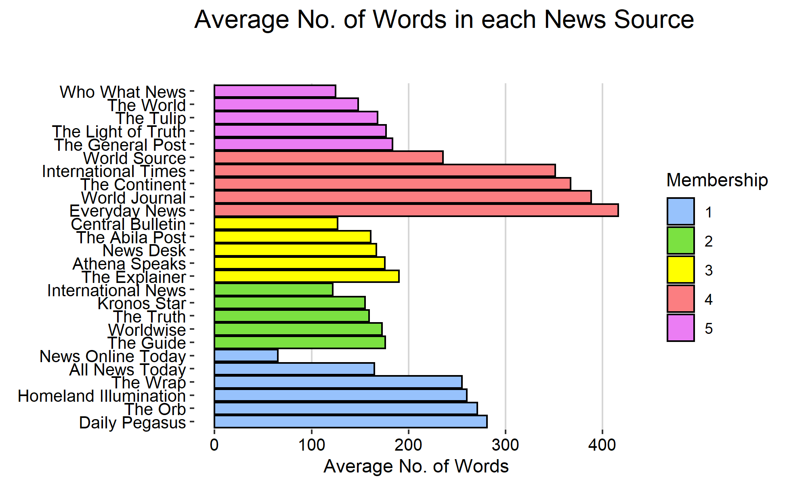
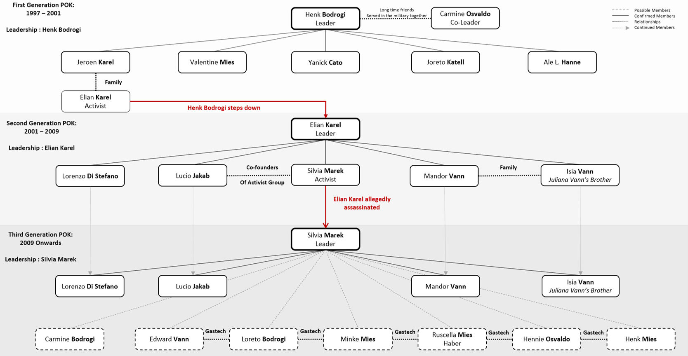
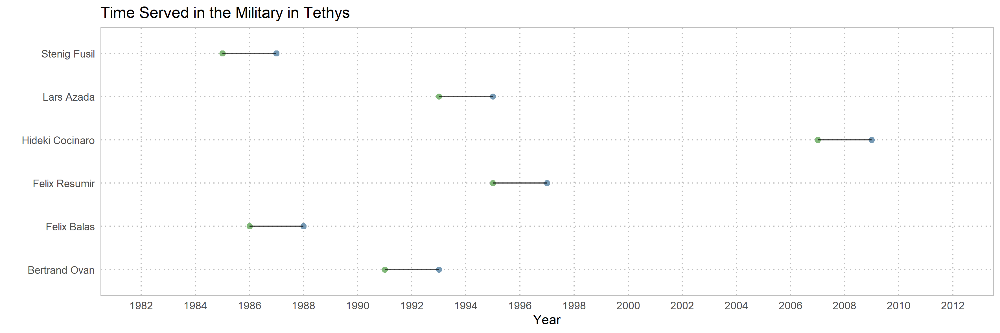

<style>

d-article div.sourceCode {
    background-color: rgba(247, 230, 230, 0.05);
    border-color: blue;
    border: 1px solid rgba(249, 83, 85, 0.2);
    border-radius: 1px;
    overflow-x: auto !important;
    max-width: 704px;

}

d-article pre{
    background-color: rgba(217, 217, 217, 0.05);
    #border: 1px solid rgba(217, 217, 217, 0.2);
    border-radius: 1px;
    overflow-x: auto !important;
    max-width: 704px;
}
.tooltip {
  position: relative;
  display: inline-block;
  border-bottom: 1px dotted black;
  background-color: white;
  border-color: coral;
}

.tooltip .tooltiptext {
  visibility: visible;
  width: auto;
  background-color: white;
  color: #000000;
  text-align: center;
  border-radius: 6px;
  padding: 5px 0;
  position: absolute;
  z-index: 1;
  bottom: 150%;
  left: 50%;
  margin-left: -60px;
}

</style>


```{css echo = FALSE}
body {line-height: 1;}
```

```{css zoom-lib-src, echo = FALSE}
script src = "https://ajax.googleapis.com/ajax/libs/jquery/3.4.1/jquery.min.js"
```


```{js zoom-jquery, echo = FALSE}
 $(document).ready(function() {
    $('body').prepend('<div class=\"zoomDiv\"></div>');
    // onClick function for all plots (img's)
    $('img:not(.zoomImg)').click(function() {
      $('.zoomImg').attr('src', $(this).attr('src')).css({width: '100%'});
      $('.zoomDiv').css({opacity: '1', width: 'auto', border: '1px solid white', borderRadius: '5px', position: 'fixed', top: '50%', left: '50%', marginRight: '-50%', transform: 'translate(-50%, -50%)', boxShadow: '0px 0px 50px #888888', zIndex: '50', overflow: 'auto', maxHeight: '100%'});
    });
    // onClick function for zoomImg
    $('img.zoomImg').click(function() {
      $('.zoomDiv').css({opacity: '0', width: '0%'}); 
    });
  });
```


```{r, echo=FALSE}
knitr::opts_chunk$set(tidy.opts=list(blank=FALSE, width.cutoff = 30), fig.retina = 2, echo = F)
```

**Click on the Images to see an enlarged version**

## Insights for Question 1


The news sources  "Tethys News", "Centrum Sentinel" and "Modern Rubicon" have been excluded from this as they largely only reported in 2014(kidnappings) and might skew the data. 

Similar news sources are colored as shown below:

```{r}
knitr::include_graphics('images/5-1-1.png')
```


News Online Today as the smallest average length of words, while cluster 4 have the highest lengths. 

```{r}

```


Using TF-IDF, we can see:

* Cluster 1: Across the news sources, the most relevant words are related to the people of Elodis.
* Cluster 2: Across the news sources, the most relevant words are related to the designer drug situation in Abila.
* Cluster 3: Across the news sources, the most relevant words are related to the arrest details/protest situations.
* Cluster 4: Across the news sources, the most relevant words are related to the designer drug situation in Abila. 
* Cluster 5: Across the news sources, the most relevant words are related to the GasTech and the industry. 


```{r}

```


The chart flows below are extracted events that have occurred surrounding GasTech (Hank Fluss's death), APA (Drug dealings) and POK (arrests). 

### Primary Source: The World

```{r}

```


We can see that Who What News derives the news article from The World. This is evident from the retention of the world "Centrum". News Online Today as we shall also see in the following analysis are a collection of all the primary new sources. This explains the high betweeness of the node. 

The Light of Truth, The General Post and The Tulip are all derivative sources are they not only posted some time later, but also are in fact translations of the original article posted. There might be double translations happening as there is meaning lost. 

For e.g. in the texts highlighted in purple, we can see that Centrum, a place in Tethys, has become translated/doubble translated into "centrum of the company" or "center of the company. This also possibly implies that The Tupli and The General Post might be printed/derived from the same language. 

The word "wildcatters", highlighted in green, tells us the Light of Truth, the General Post and The Tulip are all derived from The World as it only appears in that news article.

```{r}

```

Hence the primary source in this cluster is *The World*. 

### Primary Source: Homeland Illumination & Kronos Star

The chart below shows the links between the news sources during the arrests at the Tiskele River in 2005. 

```{r}

```


The first documentation of the arrests was noted on the 5th of April 2005 by Homeland Illumination with a specific number 15. The second document of the event was done by International News with more specific capturing of events but give a vague number of "more than a dozen".

Once that is identified, we can see that within a community, the new sources derive from the primary source. In this case, the primary source is Kronos Star for Community 2 and Homeland Illumination for Community 1. 

While Kronos Star and International News was published on the same day, Kronos Star is the primary 

Proof: Arrests at Tiskele Bend in August 2001

```{r}

```

Community 1: 
News Online Today is short re-write of the article written by Kronos Star, while International News is a longer write-up. The statement by Gastech Spokesman, Rufus Dyrmasi is not included. 

Worldwide, The Guide and The Truth are translated/double translated derivations of article by Kronos Star. This is evident from the translations of the Tiskele bend highlighted on purple. 


Community 2: 
All News Today is derivation of Homeland Illumination, a re-write. 

The Orb and the Wrap and translations of Homeland Illuminations versions. This is evident from the "Tiskele bend" being converted into "curve of Tiskele" and "bending Tiskele". They might be different languages. The Daily Pegasus is also a derived source of Homeland Illumination due to use of the term "pre-dawn" that is not in both The Orb and The Wrap. 

New Oneline Today also reprints from both sources. News Online Today is a secondary source for many of the new sources. 

For many such articles, community 1 and 2 are linked. However, they differ in terms of biases (see next section)

### Primary Source: Abila Post 

```{r}
knitr::include_graphics('images/5-KronosStar.png')
```

In 2011, POK was declared as a public threat by the Government of Kronos. 

Community 2 and Community 3 reported on that event. 

Like discussed previously Community 2's primary source is Kronos Star. For Community 3, Abila Post is. 

As an add-on, The Guide, The Truth and Worldwise are translations. 

Community 3:
Central Bulletin, News Desk and The Explainer are derivative sources. This is evident from the phrase, "A shop owner in the Siopa district". 

Central Bulletin is a re-write as the grammatical correctness of the phrase "A Shop Owner in the Siopa district" is preserved in addition to other terms. 

The derivative sources are: Central Bulletin, News Desk, The Explainer and Athena Speaks. However, The Explainer manages to retain much of the original meaning. 

### Primary Source: International Times

```{r}

```

Community 5's primary source is International Times, as it was the first to publish the article on the drug situation in Abila. 

As discussed previously, News Online Today, likely an online source, is a short re-write of the article. The other news sources, The Continent, Everyday News, World Journal are translations of the original article, 


## Insights for Question 2

Using Latent Dichrelet Allocations, we have identified the following topics in the different clusters found above.

We can get a general idea of the topics that each of the clusters covers:

### Cluster 1

Cluster 1, whose primary source is Homeland Illumination, are supporters of the POK. 

The common words, shown in the wordcloud below, tell us that there is a sense of sympathy and support for the citizens of Elodis.

```{r, out.width=400}
knitr::include_graphics('images/5-1-6-1.png')
```


This chart also shows articles that evidently point to new sources in support of POK. 

```{r}

```


### Cluster 2

Cluster 2, whose primary source is Kronos Star, are against the POK. 

The most common word is Kapelou, which refers to both President Kapelou and the Minister of Health. President Kapelou seemed to be against the POK, declaring them as a public threat. Cluster 2 also is more patriotic, often using words such as "our government" and believe that the POK is against the government of Kronos. 

```{r, out.width=400}

```


```{r}

```


### Cluster 3

Cluster 3, whose primary source The Abila Post, also leans towards being against the POK however, they're more balanced.

```{r, out.width=400}
knitr::include_graphics('images/5-1-6-3.png')
```


```{r}
knitr::include_graphics('images/5-1-12A.png')
```

### Cluster 4

Cluster 4, whose primary source is International Times, focuses on drug situations in Abila. There are no evident biases.

```{r, out.width=400}

```


```{r, out.width=400}
knitr::include_graphics('images/5-1-14A.png')
```

### Cluster 5

Cluster 4, whose primary source is The World, focuses on largely GasTech. 

```{r, out.width=400}

```


```{r}
knitr::include_graphics('images/5-1-13A.png')
```


## Insights for Question 3

### At First Glance

The first and second generations of the POK are largely documented by both the 5-year and 10-year historical documents. However, beyond that, the POK members are not identified.

Based on the last names of the first generation leaders, the possible extended network could be Edward Vann, Loreto Bodrogi, Minke Mies, Ruscella Mies Haber, Hennie Osvaldo, Henk Mies, and Carmine Bodrogi. 


```{r, out.width=700}

```


A confirmed member of the POK who is in GasTech is Isia Vann. He is not only a member, but has a strong motive for continuing POK activities within GasTech as he was the brother of Juliana Vann, the martyr image of POK.  Most likely, those who are in constant contact with Isia Vann on suspicious topics are likely connected to the POK as well. 

The plot below shows that department network as GasTech

```{r, out.width=700}
knitr::include_graphics('images/5-Department_Network.png')
```


Possible members of the POK coud be in the Facilities or Security department, which are key areas, with the exception of Ruscella Mies Haber, who is in the admin department and assistant to the engineering group manager, Lidelse Dedos. This could be a crucial link as the administration department has access to most of what happens with the company. 


```{r, out.width=700}

```


Isia Vann is approximately the same age, 25-30, as the other suspected members of the POK, except for Ruscella Mies Haber. 

Her age and middle name suggest that she might have been married to Valentine Mies. Any person with close links to Isia Vann is likely a member of the POK. 


```{r age, out.width=700}

```   


We can also see that, by the text groupings, most of the employees are within their department except for Linnea Bergen. She might also be a part of the extended network of POK. This poses a strange question as Linnea Bergen has little to do with Kronos as her citizenship is from Tethys and she does not seem to have much connections to Isia Vann.

```{r, out.width=700}

```


```{r city_tethys, out.width=700, echo=F, eval=F}

```

The chart below shows that all of the facilities departmentand possible POK associates hold Kronos citizenship. 

```{r city_kronos, out.width=700}

```


```{r army_tethys, out.width=700, eval=F}

```

Isia Vann joined GasTech as soon as he was out of the army. This is quite suspicious as he is a confirmed member of the POK. 

We can see that in 2013, many of suspected members joined in 2013 in key areas of Security and Facilities.

```{r year_joined, out.width=700}

```

### Not a first Glance

Apart from Linnea Bergen, there are other members of GasTech that might be linked to either POK or the APA that are not immediate suspects. Also identified from new sources, some might be members of the APA.

<u> Isia Vann vs Rachel Pantanal </u>

Isia Vann seems to be in a relationship with Rachel Pantanal, the authencity of the relationship from Isia's end could be doubted as Rachel is in a crucial position within GasTech, being the assistant to the CIO, Ada Campo-Corrente.

However, despite Rachel being a citizen of Tethys, she nevertheless forwarded an email by the APA. 


```{r isia-rachel, out.width=700}

```

Carmin Bodrogi

Carmine Bodrogi was arrested in 2011 on the intent of possible distribution of MDMC, which is a drug trafficked by the APA. In 2014, Carmine Bodrogi is approximately 21 years old. She might be related to Loreto Bodrogi.

```{r}

```

ARISE, is a publication magazine by the APA (International Times 2013-10-21).

There are possible suggestion of links between the POK and the APA. Possibly indicating that this is how POK recruits new members under Silvia Marek's weak leadership.

The following likely confirms that Hennie Osvaldo, Inga Ferro, Loreto Bodrogi, Minke Mies and Ruscella Mies Haber are the extended network of POK. 

```{r}

```

A strange email "Caution Downtown" was sent on the 7th of January. throughout members of the facilities team. 

```{r}


```


These could be warnings about possible drug busts around town, as Varro Awelon, who shares the same last name as Cynthe Awelon, is about 5 years younger. They might be possibly related. 


```{r}
knitr:: 
```

In addition to that, we can also see that many of the facilies department has spent time together in the Army. This dates back their possibly knowing each other. 

```{r army_kronos, out.width=700}


```


```{r}


```


```{r}


```

Edward Vann's network remains within Kanon Herreo, Inga Ferro, Hennie Osvaldo, Minke Mies and Felix Resumir for 7th & 9th January. On the 14th Loreto Bodrogi, then re-sends another email with the same heading to the rest of the network.

This might suggest that Inga Ferro, Varja Lagos,

This is suspicious as Felix Resumir is kept out of that email chain, including Edward Vann. This might clear Edward Vann as a suspected member of the POK. (Further proof: Interrogation of Edward Vann on the day of kidnapping.)

This could also suggest that POK member use email subjects that have been used before for other conversations i.e. they might be code words. 

Also, there might be duplicate emails being sent with the same subject but different email content to bring suspicion away from the members. Hence, emails to Kanon Herrero, Hideki Cocinaro and possibly Varja Lagos from Loreto Bodrogi may be decoy emails. 

Another such suspicious email is below:

```{r}

```

Linnea Bergen first sent the mail to Ruscella at 12 am on the 13th. After which, Rachel Pantanal was added. On the 14th, a day later, the email was sent to the others in the security department. 

This is likely not about a virus, and rather a code word as the members are those already suspected of being involved with the POK/APA. 

This doubly confirms that Inga Ferro, Linnea Bergen and Rachel Pantanal are involved with the POK. 


