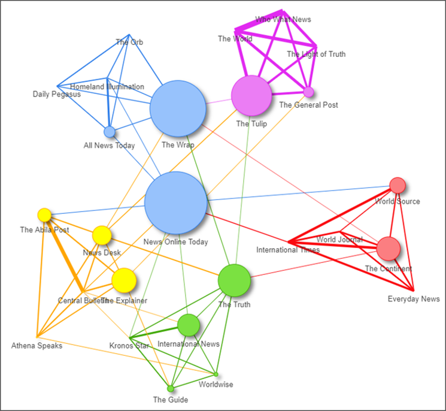
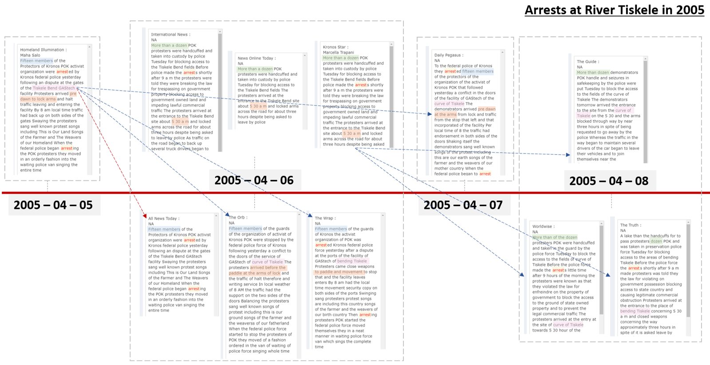

<style>

d-article div.sourceCode {
    background-color: rgba(247, 230, 230, 0.05);
    border-color: blue;
    border: 1px solid rgba(249, 83, 85, 0.2);
    border-radius: 1px;
    overflow-x: auto !important;
    max-width: 704px;

}

d-article pre{
    background-color: rgba(217, 217, 217, 0.05);
    #border: 1px solid rgba(217, 217, 217, 0.2);
    border-radius: 1px;
    overflow-x: auto !important;
    max-width: 704px;
}
.tooltip {
  position: relative;
  display: inline-block;
  border-bottom: 1px dotted black;
  background-color: white;
  border-color: coral;
}

.tooltip .tooltiptext {
  visibility: visible;
  width: auto;
  background-color: white;
  color: #000000;
  text-align: center;
  border-radius: 6px;
  padding: 5px 0;
  position: absolute;
  z-index: 1;
  bottom: 150%;
  left: 50%;
  margin-left: -60px;
}

</style>


```{css echo = FALSE}
body {line-height: 1;}
```

```{css zoom-lib-src, echo = FALSE}
script src = "https://ajax.googleapis.com/ajax/libs/jquery/3.4.1/jquery.min.js"
```


```{js zoom-jquery, echo = FALSE}
 $(document).ready(function() {
    $('body').prepend('<div class=\"zoomDiv\"></div>');
    // onClick function for all plots (img's)
    $('img:not(.zoomImg)').click(function() {
      $('.zoomImg').attr('src', $(this).attr('src')).css({width: '100%'});
      $('.zoomDiv').css({opacity: '1', width: 'auto', border: '1px solid white', borderRadius: '5px', position: 'fixed', top: '50%', left: '50%', marginRight: '-50%', transform: 'translate(-50%, -50%)', boxShadow: '0px 0px 50px #888888', zIndex: '50', overflow: 'auto', maxHeight: '100%'});
    });
    // onClick function for zoomImg
    $('img.zoomImg').click(function() {
      $('.zoomDiv').css({opacity: '0', width: '0%'}); 
    });
  });
```


```{r, echo=FALSE}
knitr::opts_chunk$set(tidy.opts=list(blank=FALSE, width.cutoff = 30))
```

Characterising News Sources <br> 

Using the `TextNet` package, the news sources have be clustered as shown below based on the shared words. 

The news sources  "Tethys News", "Centrum Sentinel" and "Modern Rubicon" have been excluded from this as they largely only reported in 2014(kidnappings) and might skew the data. 

Similar news sources are colored as shown below:

```{r}
knitr::include_graphics('images/5-1-1.png')
```

Average Length of Words

```{r}
knitr::include_graphics('images/5-1-2.png')
```

TF-IDF 

```{r}
knitr::include_graphics('images/5-1-3.png')
```


Using TF-IDF, we can see:

Cluster 1: Across the news sources, the most relevant words are related to the people of Elodis.
Cluster 2: Across the news sources, the most relevant words are related to the designer drug situation in Abila.
Cluster 3: Across the news sources, the most relevant words are related to the arrest details/protest situations.
Cluster 4: Across the news sources, the most relevant words are related to the designer drug situation in Abila. 
Cluster 5: Across the news sources, the most relevant words are related to the GasTech and the industry. 


Centrality 

```{r}

```


What are the relationships between the primary and derivative sources? 

The chart flows below are extracted events that have occurred surrounding GasTech (Hank Fluss's death), APA (Drug dealings) and POK (arrests). 


```{r}

```


We can see that Who What News derives the news article from The World. This is evident from the retention of the world "Centrum". News Online Today as we shall also see in the following analysis are a collection of all the primary new sources. This explains the high betweeness of the node. 

The Light of Truth, The General Post and The Tulip are all derivative sources are they not only posted some time later, but also are in fact translations of the original article posted. There might be double translations happening as there is meaning lost. 

For e.g. in the texts highlighted in purple, we can see that Centrum, a place in Tethys, has become translated/doubble translated into "centrum of the company" or "center of the company. This also possibly implies that The Tupli and The General Post might be printed/derived from the same language. 

The word "wildcatters", highlighted in green, tells us the Light of Truth, the General Post and The Tulip are all derived from The World as it only appears in that news article.

```{r}
knitr::include_graphics('images/5-1-9.png')
```

Hence the primary source in this cluster is *The World*. 

The chart below shows the links between the news sources during the arrests at the Tiskele River in 2005. 

```{r}

```


The first documentation of the arrests was noted on the 5th of April 2005 by Homeland Illumination with a specific number 15. The second document of the event was done by International News with more specific capturing of events but give a vague number of "more than a dozen".

Once that is identified, we can see that within a community, the new sources derive from the primary source. In this case, the primary source is Kronos Star for Community 2 and Homeland Illumination for Community 1. 

While Kronos Star and International News was published on the same day, Kronos Star is the primary. (PROVED).

Community 1: 
News Online Today is short re-write of the article written by Kronos Star, while International News is a longer write-up. The statement by Gastech Spokesman, Rufus Dyrmasi is not included. 

Worldwide, The Guide and The Truth are translated/double translated derivations of article by Kronos Star. This is evident from the tranlations of the Tiskele bend highlighted on purple. 


Community 2: 
All News Today is derivation of Homeland Illumination, a re-write. 

The Orb and the Wrap and translations of Homeland Illuminations versions. This is evident from the "Tiskele bend" being converted into "curve of Tiskele" and "bending Tiskele". They might be different languages. The Daily Pegasus is also a derived source of Homeland Illumination due to use of the term "pre-dawn" that is not in both The Orb and The Wrap. 


For many such articles, community 1 and 2 are linked. 


```{r}

```

In 2011, POK was declared as a public threat by the Government of Kronos. 

Community 2 and Community 3 reported on that event. 

Like discussed previously Community 2's primary source is Kronos Star. For Community 3, Abila Post is. 

As an add-on, The Guide, The Truth and Worldwise are translations. 

Community 3:
Central Bulletin, News Desk and The Explainer are derivative sources. This is evident from the phrase, "A shop owner in the Siopa district". 

Central Bulletin is a re-write as the grammatical correctness of the phrase "A Shop Owner in the Siopa district" is preserved in addition to other terms. 

The derivative sources are: Central Bulletin, News Desk, The Explainer and Athena Speaks. However, The Explainer manages to retain much of the original meaning. 


```{r}

```

Community 5's primary source is International Times, as it was the first to publish the article on the drug situation in Abila. 

As discussed previously, News Online Today, likely an online source, is a short re-write of the article. The other news sources, The Continent, Everyday News, World Journal are translations of the original article, 


### 5.2 Question 2

Using Latent Dichrelet Allocations, we have identified the following topics in the different clusters found above.

We can get a general idea of the topics that each of the clusters covers:

```{r}

```


```{r}
knitr::include_graphics('images/5-1-10.png')
```


```{r}
knitr::include_graphics('images/5-1-10A.png')
```


```{r}
knitr::include_graphics('images/5-1-6-2.png')
```


```{r}

```

```{r}
knitr::include_graphics('images/5-1-11A.png')
```


```{r}
knitr::include_graphics('images/5-1-6-3.png')
```


```{r}

```


```{r}
knitr::include_graphics('images/5-1-12A.png')
```


```{r}
knitr::include_graphics('images/5-1-6-4.png')
```


```{r}

```


```{r}

```


```{r}
knitr::include_graphics('images/5-1-6-5.png')
```


```{r}

```


```{r}

```

### 5.3 Question 3


### 5.4 Question 4


