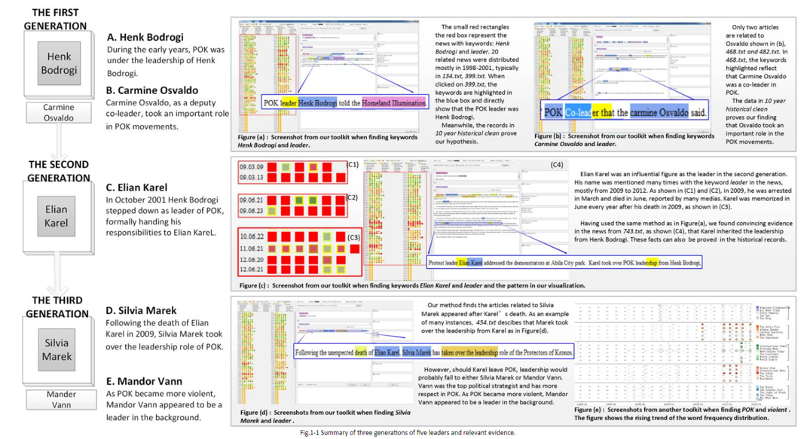

<style>

d-article div.sourceCode {
    background-color: rgba(247, 230, 230, 0.05);
    border-color: blue;
    border: 1px solid rgba(249, 83, 85, 0.2);
    border-radius: 1px;
    overflow-x: auto !important;
    max-width: 704px;

}

d-article pre{
    background-color: rgba(217, 217, 217, 0.05);
    #border: 1px solid rgba(217, 217, 217, 0.2);
    border-radius: 1px;
    overflow-x: auto !important;
    max-width: 704px;
}
.tooltip {
  position: relative;
  display: inline-block;
  border-bottom: 1px dotted black;
  background-color: white;
  border-color: coral;
}

.tooltip .tooltiptext {
  visibility: visible;
  width: auto;
  background-color: white;
  color: #000000;
  text-align: center;
  border-radius: 6px;
  padding: 5px 0;
  position: absolute;
  z-index: 1;
  bottom: 150%;
  left: 50%;
  margin-left: -60px;
}

</style>


```{css echo = FALSE}
body {line-height: 1;}
```

```{css zoom-lib-src, echo = FALSE}
script src = "https://ajax.googleapis.com/ajax/libs/jquery/3.4.1/jquery.min.js"
```

```{js zoom-jquery, echo = FALSE}
 $(document).ready(function() {
    $('body').prepend('<div class=\"zoomDiv\"></div>');
    // onClick function for all plots (img's)
    $('img:not(.zoomImg)').click(function() {
      $('.zoomImg').attr('src', $(this).attr('src')).css({width: '100%'});
      $('.zoomDiv').css({opacity: '1', width: 'auto', border: '1px solid white', borderRadius: '5px', position: 'fixed', top: '50%', left: '50%', marginRight: '-50%', transform: 'translate(-50%, -50%)', boxShadow: '0px 0px 50px #888888', zIndex: '50', overflow: 'auto', maxHeight: '100%'});
    });
    // onClick function for zoomImg
    $('img.zoomImg').click(function() {
      $('.zoomDiv').css({opacity: '0', width: '0%'}); 
    });
  });
```

```{r, echo=FALSE}
knitr::opts_chunk$set(tidy.opts=list(blank=FALSE, width.cutoff = 30), echo = F)
```


## 1 Introduction

Fourteen employees of GasTech have gone missing. While some fear that they have been kidnapped by the radical environment terrorist group, Protectors of Kronos, some news sources believe that they have simply absconded with the money. 

In this analysis, we have used network and text analysis to understand the complex relationship between various entities, possibly revealing the true events of what happened in Abila. 

## 2 Literature Review

Mini challenge 1 deals with most text and network data, hence the literature review would be a critique of such analysis/visuals. 

All references can be found here: [Link](https://www.cs.umd.edu/hcil/varepository/VAST%20Challenge%202014/challenges/MC1%20-%20Disappearance%20at%20GASTech/)

### Analysis of News Articles

<u>Reference: VAST Challenge 2014, Submission:  Tianjin University, China (Entry Name: TJU-Cai-MC1)</u>


```{r, out.width=700}

```

To understand the primary and secondary and biases in the news sources (MC1 2021 Question 1 & 2), we will rely on CorporaExplorer. This is similar to the software that the team has used above. 

Clarity: 

* Due to the red box representing the important new articles, it remains unclear what is being highlighted to us as all of the squares are bordered by the red box. This could be made clearer, with possible snapshots of the articles with highlight keywords.

* The news articles shown with the magnified sentences serve no purpose. It is redundant ink as the user is not only unable to read what the article is actually saying, but also that there are too many visual distractions on the page.


Aesthetics: 

* The colors used are bright warning colors, i.e. red, yellow, orange. This sets off a confusing visualisation as we're unsure as to which information is crucial. 
* The writer has screenshot the entire background of the software, this is not required, as it creates redundant ink. 


<u>Reference: VAST Challenge 2014, Submission:  Peking University (Entry Name: PKU-WANG-MC1)</u>

```{r, out.width=700}

```

Clarity:

* The writer has uploaded an image with redundant pieces of information that is possibly quoting data out of context or simply unreadable. 

Aesthetics:

* There is too much white space as all the information we require is in the second half of the image, including the date information. 


Another analysis of the submission is mapping the timelines.

```{r, out.width=700}

```


Clarity:

* There is an "00:00" timestamp next to the dates of the news articles. THis might create some confusion as the actual timed updates are in the article itself
* For one of the screenshots, "news292" the time is hidden.

Aesthetics:

* The overlapping text boxes create a messy look
* There is redundant information in the backgroun

### Analysis of Relationship/Email Networks


<u>Reference: VAST Challenge 2014, Submission:  University of Buenos Aires (Entry Name: UBA-Avila-MC1)</u>

```{r, out.width=700}

```

Clarity:

* The arrows leading out from Elian Karel makes it seem as though Mandor Vann and Silvia Marek are both leaders, however, that is not the case. 
* There is no timeline mentioned in the diagram
* The text box focuses on a lot on Elian Karel, while the diagram is mapping out the leadership dynamics of the POK. The text box essentially is quoting data out of context. 

Aesthetics:

* There is not much contrast between the white and orange,  and black and maroon. This is a poor choice of colors.


```{r, out.width=400}

```

Clarity:

* The timeline is not clear to the reader
* There is an empty circle with no name assigned to it
* In addition to that, the size of the circles might be misleading. It might be misconstrued that the size of the circle is relative to their importance in POK.
It might seem that Silvia Marek, POK's leader after Elian Karel's death, is less important than Lucio Jakab, who is not mentioned in any news articles. 

Aesthetics

* There is redundant ink i.e. the outermost circle. The use of circles tends to increase non-data ink substantially as it is a shape of bilateral symmetry. A network diagram would be better.


```{r, out.width=700}
knitr::include_graphics('images/LitRev-6.png')
```

Clarity:

* The chart is undirected, it might suggest to the reader that the chart is highlighting relationships rather that email correspondence which are directional. 


Aesthetics:

* The color contrasts are poor


<u>Reference: VAST Challenge 2014, Submission:  Tianjin University, China (Entry Name: TJU-Cai-MC1)</u>

```{r}

```

Clarity: 

* The military service does not explicitly show the overlap of the period of military service. 
* The last names of the GasTech employees could have been highlighted without the need for the background. This creates confusion for the reader as there is data that is out of context


Aesthetics:

* The font is unclear and hard to read

```{r, out.width=700}

```


Clarity: 

* It is unclear what the stars or direction of the emails are i.e. it is undirected
* There is no legend provided for the different colored lines
* The reiteration of the email subjects might create confusion as some of it is directly in line with the conversation tracker

Aesthetics

* There are too many bright warning colors without actually refering to any important piece of information. 


